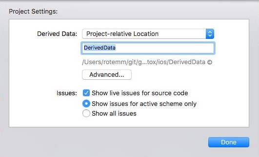

> detox


## Getting Started With Detox

#### Step 0: Remove Previous Detox Integration (for `detox@3.x.x` users)

If you have integrated with Detox in the past, you will need to clean your project before integrating with current Detox version.

* Use the provided `cleanup_4.0.rb` to remove unneeded changes made with Detox 4.0.x.
* Make sure to add changes performed by running this script to version control.

#### Step 1: Installing Dependencies

* Install the latest version of [`brew`](http://brew.sh).
* If you haven't already, install Node.js

 ```sh
 brew update && brew install node 
 ```

* You'd also need `fbsimctl` installed: 

 ```sh 
 brew tap facebook/fb && brew install fbsimctl
 ```
 
* Detox CLI
 	
  `detox-cli` package should be installed globally, enabling usage of detox command line tools outside of your npm scripts.

  ```sh
  npm install -g detox-cli
  ```

* If you do not have a `package.json` file in the root folder of your project, create one by running 

  ```sh
  npm init
  ```
  Follow the on screen instructions.

##### Set Xcode build path
By default, Xcode uses a randomized hidden path for outputting project build artifacts, called DerivedData. For ease of use (and better support in CI environments), it is recommended to change the project build path to a more convenient path.

* With your project opened in Xcode, select menu `File` ► `Project Settings...`. Click on `Advanced...`, select `Custom` and from the drop-down menu, select `Project-relative Location`.
* Build artifacts will now be created in a `DerivedData` folder next to your `xcodeproj` project.



#### Step 2: Create or Modify Your `package.json` for Detox

* Add `detox` to the `devDependencies` section of `package.json`:

```sh
npm install detox --save-dev
```

* Detox needs to run inside a test runner (there are many out there: [karma](https://github.com/karma-runner/karma), [mocha](https://github.com/mochajs/mocha), [ava](https://github.com/avajs) etc.). Currently, we recommend mocha.

```sh
npm install mocha --save-dev
``` 

* Add to the `scripts` section of `package.json`:


* Add a `detox` section to `package.json`:


	`configurations`: holds all the device configurations, if there is only one configuration in `configurations` `detox build` and `detox test` will default to it, to choose a specific configuration use `--configuration` param<br>
	

	**per configuration: **
	
	Configuration Params|     Details     |
	--------------------|-----------------|
	`binaryPath`			| relative path to the ipa/app due to be tested (make sure you build the app in a project relative path) |
	`type` 				| device type, currently on `simulator` (iOS) is supported |
	`name`					| device name, aligns to the device list avaliable through `fbsimctl list` for example, this is one line of the output of `fbsimctl list`: `A3C93900-6D17-4830-8FBE-E102E4BBCBB9 | iPhone 7 | Shutdown | iPhone 7 | iOS 10.2`, ir order to choose the first `iPhone 7` regardless of OS version, use `iPhone 7`. to be OS specific use `iPhone 7, iOS 10.2` |
	`build`				| **[optional]** build command (either `xcodebuild`, `react-native run-ios`, etc...), will be later available through detox CLI tool. |
	
	

	##### example:
	
	```json
	"detox": {
	  "configurations": {
	      "ios.sim.release": {
	        "binaryPath": "ios/build/Build/Products/Release-iphonesimulator/example.app",
	        "build": "xcodebuild -project ios/example.xcodeproj -scheme example -configuration Release -sdk iphonesimulator -derivedDataPath ios/build",
	        "type": "simulator",
	        "name": "iPhone 7"
	      }
	    } 
	  }
	```
	
	##### Optional: setting a custom server
	Detox can either initialize a server using a generated configuration, or can be overriden with a manual  configuration:
	
	```json
	"detox": {
	  ...
	  "session": {
		"server": "ws://localhost:8099",
		"sessionId": "YourProjectSessionId"
	  }
	}
	```
	##### Optional: setting a custom test root folder
	Applies when using `detox-cli` by running `detox test` command, default is `e2e`.
	
	```json
	"detox": {
	  ...
	  "specs": "path/to/tests"
	}
	```
	

#### Step 3: Prepare the E2E Folder for Your Tests (using mocha test runner)

* Create an `e2e` folder in your project root
* Create `mocha.opts` file with this [content](examples/demo-react-native/e2e/mocha.opts).
* Create `init.js` file with this [content](examples/demo-react-native/e2e/init.js).
* Create your first test! `myFirstTest.spec.js` with content similar to [this](examples/demo-react-native/e2e/example.spec.js).

#### Step 4: Building your app and Running Detox Tests
By using `detox` command line tool, you can build and test your project easily.

##### Setup
In your detox config (in package.json) paste your build command into the configuration's `build` field. 
The build command will be triggered when running

If there's only one configuration, you can simply use:

```sh
detox build
```
For multiple configurations, choose your configuration by passing `--configuration` param:

```sh
detox build --configuration yourConfiguration
```

* We have prepared a build command in `detox-cli` that can help you control your tests easily

#### Step 4.1: Build Your Project
You can now choose to build your project in any of these ways...

* Through `detox`:
	
	```sh
	detox build --configuration yourConfiguration
	```
* Building with xcodebuild:

 ```sh
  xcodebuild -project ios/YourProject.xcodeproj -scheme YourProject -sdk iphonesimulator -derivedDataPath ios/build
 ```
	
* Building using React Native, this is the least suggested way of running your build, since it also starts a random simulator and installs the app on it.
	
  ```sh 
  react-native run-ios
  ```
	  
* If you have build problems, see [troubleshooting](#troubleshooting-build-problems).

> Note: remember to update the `app` path in your `package.json`.

#### Step 4.2: Run Your Tests

If there's only one configuration, you can simply use:

```sh
detox test
```
For multiple configurations, choose your configuration by passing `--configuration` param:

```sh
detox test --configuration yourConfiguration
```