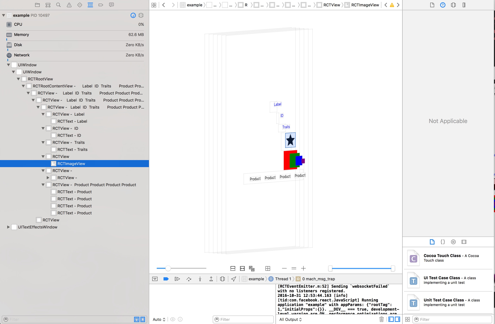

## Usage Examples

### Matchers

#### View by label:

```xml
  <View style={{flex: 1, paddingTop: 20, justifyContent: 'center', alignItems: 'center'}}>
        <Text style={{fontSize: 25, marginBottom: 30}}>
          Welcome
        </Text>
        {this.renderTestButton('Say Hello', this.onButtonPress.bind(this, 'Hello'))}
        {this.renderTestButton('Say World', this.onButtonPress.bind(this, 'World'))}
      </View>
```

```js
element(by.label('Welcome')))
```

#### View by id: 

```xml 
<View testID='Grandfather883' style={{padding: 8, backgroundColor: 'red', marginBottom: 10}}>
  <View testID='Father883' style={{padding: 8, backgroundColor: 'green'}}>
    <View testID='Son883' style={{padding: 8, backgroundColor: 'blue'}}>
      <View testID='Grandson883' style={{padding: 8, backgroundColor: 'purple'}} />
    </View>
  </View>
</View>
```


```js
element(by.id('Grandson883'))
```

```js
element(by.id('Grandson883').withAncestor(by.id('Son883')))
```

```js
element(by.id('Son883').withDescendant(by.id('Grandson883')))
```

#### View by type (native class):




```js
element(by.type('RCTImageView'))
```

#### choose from multiple elements matching the same matcher using index:

```xml
<View style={{flexDirection: 'row', marginBottom: 20}}>
  <Text testID='ProductId000' style={{margin: 10}}>Product</Text>
  <Text testID='ProductId001' style={{margin: 10}}>Product</Text>
  <Text testID='ProductId002' style={{margin: 10}}>Product</Text>
  <Text testID='ProductId003' style={{margin: 10}}>Product</Text>
</View>
```

```js
element(by.label('Product')).atIndex(2)
```

#### Multiple matchers:

```xml
<Text testID='UniqueId345' style={{color: 'blue', marginBottom: 20}}>ID</Text>
```

```js
element(by.id('UniqueId345').and(by.label('ID')))
```

### Actions:

```js
element(by.label('Tap Me')).tap();
element(by.label('Tap Me')).longPress();
element(by.id('UniqueId819')).multiTap(3);
element(by.id('UniqueId937')).typeText('passcode');
element(by.id('UniqueId005')).clearText();
element(by.id('ScrollView161')).scroll(100, 'down');
element(by.id('ScrollView161')).scroll(100, 'up');
element(by.id('ScrollView161')).scrollTo('bottom');
element(by.id('ScrollView161')).scrollTo('top');

// directions: 'up'/'down'/'left'/'right', speed: 'fast'/'slow'
element(by.id('ScrollView799')).swipe('down', 'fast');
```


### Assertions:

```js
expect(element(by.id('UniqueId204'))).toBeVisible();
expect(element(by.id('UniqueId205'))).toBeNotVisible();
expect(element(by.id('UniqueId205'))).toExist();
expect(element(by.id('RandomJunk959'))).toNotExist();
expect(element(by.id('UniqueId204'))).toHaveText('I contain some text');
expect(element(by.id('UniqueId204'))).toHaveLabel('I contain some text');
expect(element(by.label('I contain some text'))).toHaveId('UniqueId204');
expect(element(by.id('UniqueId146'))).toHaveValue('0');
```


### waitFor:

```js
waitFor(element(by.id('UniqueId336'))).toExist().withTimeout(2000);

waitFor(element(by.label('Text5'))).toBeVisible().whileElement(by.id('ScrollView630')).scroll(50, 'down');
```


### Simulator control:

```js
before(function (done) {
  simulator.reloadReactNativeApp(done);
});

before(function (done) {
  simulator.relaunchApp(done);
});

before(function (done) {
  simulator.deleteAndRelaunchApp(done);
});    
    
```
