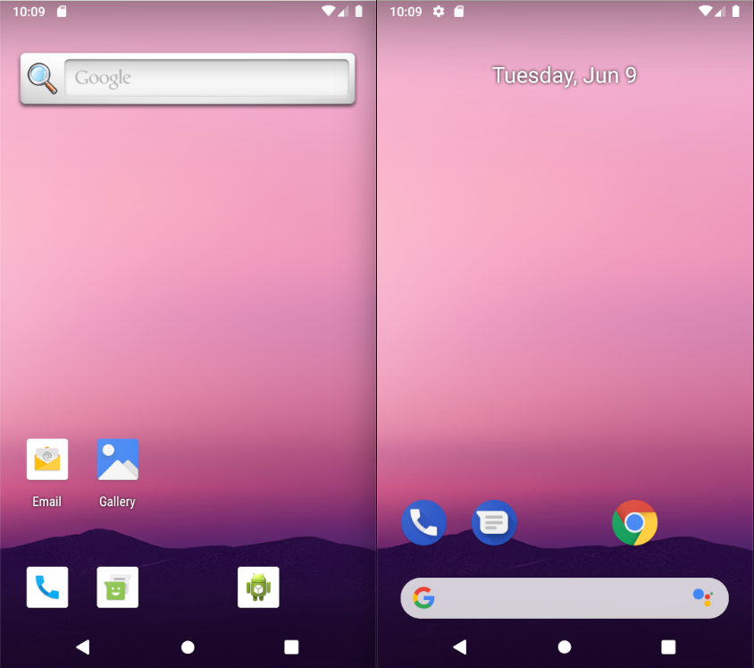
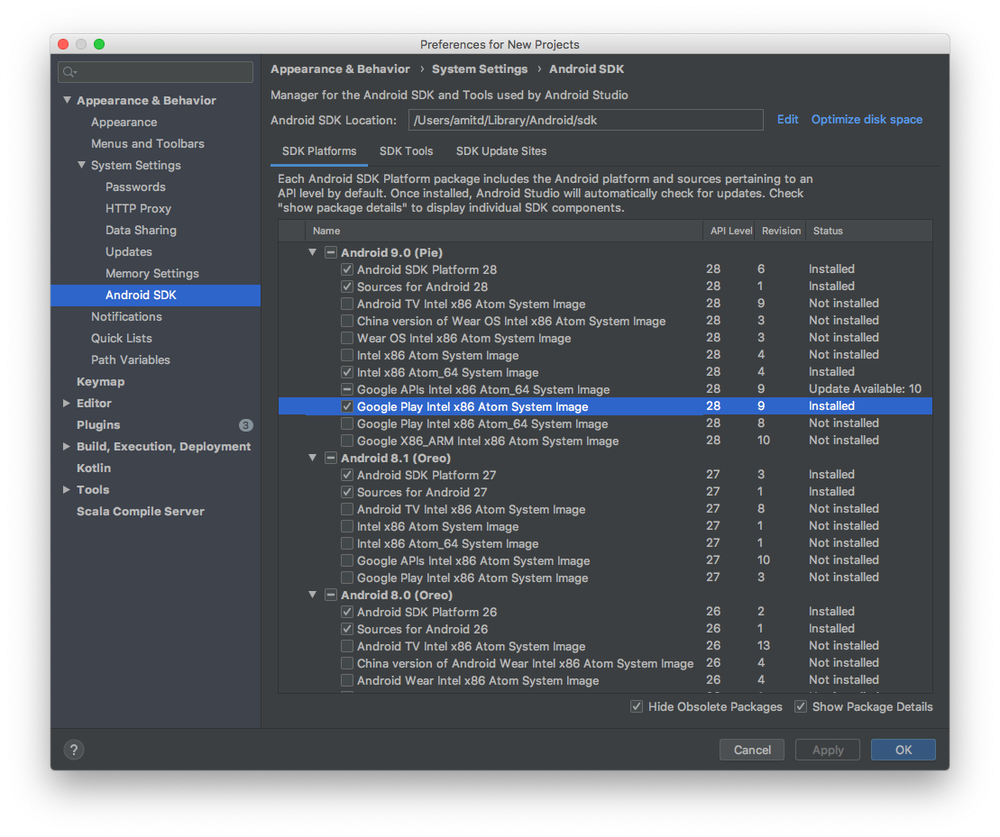
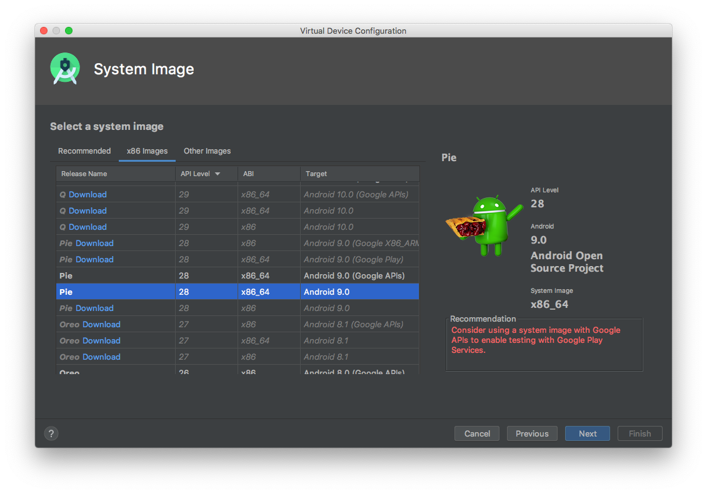
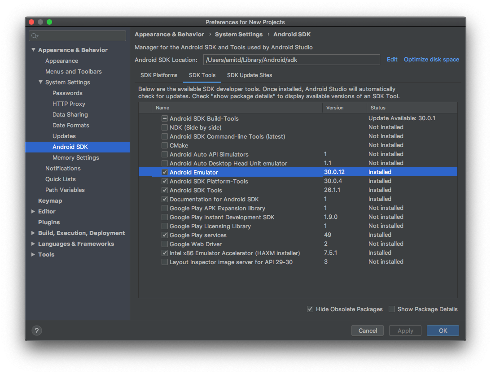
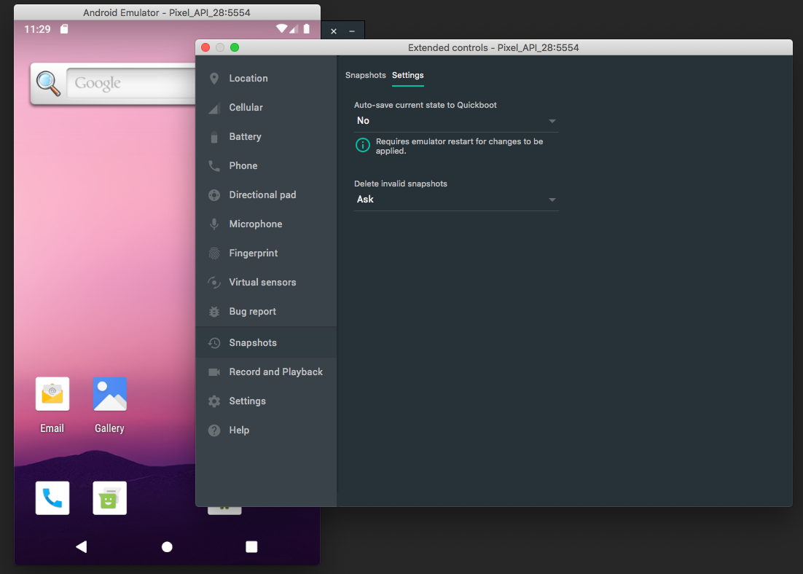

## Setting Up an Android Development & Testing Environment

This guide provides some core practices to follow in setting up a stable, reliable environment for running automated UI tests using Android emulators (using Detox, in particular) -- be it on a personal, _local_ computer, or a powerful CI machine.

Note that running automated UI tests is _not the same_ as developing Android apps. Hence, you may find yourself not 100% aligned with the recommendations here, and should consider being so.

## Java Setup

This is the most basic step in the process, as without a proper Java SDK installed, nothing Android-ish works -- at least not from command-line, which is mandatory for executing `Detox`.

_The bottom line is that **Android needs Java installed**. If you want to run with React Native 66 and Android 12 then it needs to be at least Java 11, otherwise you should have Java 8._

To check for your real java-executable’s version, in a command-line console, run:

```sh
java -version
```

What needs to be verified is that `java` is in-path and that the output contains something like this:

```sh
java version "11.x.x"
...
```

or, if you have [openjdk](https://techoral.com/blog/openjdk-developers-guide.html) installed:

```sh
openjdk version "11.0.2" 2019-01-1
...
```

**Namely, that the version is `11.x.x`**.

> Note: Do not be confused by the Java version potentially used by your browsers, etc. For `Detox`, what the command-line sees is what matters.

---

If `java -version` yields an error, it is likely that `java` is either not in your path or not even installed at all. To try to understand which of the two is true, use [this guide](https://www.java.com/en/download/help/path.xml).

If otherwise the version is simply wrong, try these course of actions:

- On MacOS, in particular, Java comes from both the OS _and_ possibly other installers such as `homebrew`. That can really get things tangled up. To mitigate:
  - Use one of the options suggested in this [Stack Overflow post](https://stackoverflow.com/questions/52524112/how-do-i-install-java-on-mac-osx-allowing-version-switching/52524114#52524114).
  - Install OpenJDK 11 on top of the existing versions ([how to check?](https://medium.com/notes-for-geeks/java-home-and-java-home-on-macos-f246cab643bd)): <https://techoral.com/blog/java/install-openjdk-11-on-mac.html>. Consider employing the `JAVA_HOME` variable to get things to work right. _Note: This is more suitable if your environment is fairly clean, and does not contain versions from 3rd-party installers (e.g. `homebrew`)._
- Use these refs, which might be useful:
  - <https://java.com/en/download/faq/java_mac.xml#version>
  - <https://www.java.com/en/download/help/version_manual.xml>

## Android SDK

If you have Android Studio installed - as most of us do, then the SDK should be available for you somewhere on your machine<sup>\*</sup>. However, for CI agents -- possibly running with no GUI, or if you simply don’t want the somewhat bloated piece of software on your computer, it is possible to simply download the SDK and tool-set, purely. Both cases are covered in Google’s [Android guide about Android Studio](https://developer.android.com/studio/). For the pure-tools option, refer to the `Command line tools only` section at the bottom.

For more help on setting the SDK up, [this guide might be helpful](https://www.androidcentral.com/installing-android-sdk-windows-mac-and-linux-tutorial).

Whatever option you choose, and whichever platform you’re running on (Mac, Linux, Windows), we strongly recommend that eventually you would have 2 additional things set up:

- The path to the SDK’s root directory is set into the `ANDROID_SDK_ROOT` [environment variable](https://developer.android.com/studio/command-line/variables).
- The path to the SDK’s root directory is bundled into the global [`PATH`](https://superuser.com/questions/284342/what-are-path-and-other-environment-variables-and-how-can-i-set-or-use-them) on your computer.

_<sup>\* Inspect the content of your `ANDROID_SDK_ROOT` and `ANDROID_HOME` environment variables.</sup>_

## Android (AOSP) Emulators

Mobile-apps' automation needs an Android device to run on. If you haven’t already done so, you should  [set up an Emulator](https://developer.android.com/studio/run/emulator). But, wait - don’t go and install the default one: read through, first.

We’ve long proven that for automation - which requires a stable and deterministic environment, Google’s emulators running with Google APIs simply don’t deliver what’s needed. Be it the preinstalled Google play-services - which tend to take up a lot of CPU, or even Google’s `gboard` Keyboard - which is full-featured but overly bloated: These encourage flakiness in tests, which we are desperate to avoid in automation.

Fortunately, the Android team at Google offers a pretty decent alternative: **AOSP emulators** (Android Open-Source Project). While possibly lacking some of the extended Google services, and a bit less fancy overall, **we strongly recommend** to strictly use this flavor of emulators for running automation/Detox tests. They can be installed alongside regular emulators.

_Here’s a visual comparison between the two - an SDK 28 (Android 9) AOSP emulator (left) vs. an emulator with Google APIs installed (right):_



### Here’s how to install them using the command line

While it’s possible to do this using Android Studio, we’ll focus on the command line, as it is also good for _headless_ CI machines.

1. Locate your 'Android home' folder - typically set in the `ANDROID_HOME` environment variable, or in its successor - `ANDROID_SDK_ROOT`. If `ANDROID_HOME` isn’t set, either set it yourself or run the following commands after `cd`-ing into the home folder.

1. Preliminary: Upgrade your `emulator` executable to the latest version.
   _Note: It is OK if the emulator’s version is not aligned with the SDK or platform-tools' version you currently have installed (e.g. 30.x.x vs. SDK 29)_

   ```sh
   $ANDROID_HOME/cmdline-tools/latest/bin/sdkmanager --install emulator
   ```

:::note
In previous Android Studio versions, the SDK-Manager path was located at `$ANDROID_HOME/tools/bin/sdkmanager`. We highly recommend working with the latest version, however, in case you are working with an old version, and this command fails, try this path instead.
:::

1. Install an emulator image without Google APIs:

   ```shell
   $ANDROID_HOME/cmdline-tools/latest/bin/sdkmanager "system-images;android-28;default;x86_64"
   $ANDROID_HOME/cmdline-tools/latest/bin/sdkmanager --licenses
   ```

   > - With `;android-28;`, we assumed SDK 28 here, but other APIs are supported just the same.
   > - The `;default;` part replaces `;google_apis;`, which is the default, and is what matters here.
   > - If you are running on a M1 you must install an arm64 architecture i.e. `system-images;android-28;default;arm64-v8a`

1. Create an emulator (i.e. AVD - Android Virtual Device):

   ```shell
   $ANDROID_HOME/cmdline-tools/latest/bin/avdmanager create avd -n Pixel_API_28_AOSP -d pixel --package "system-images;android-28;default;x86_64"
   ```

   > - `Pixel_API_28_AOSP` is just a suggestion for a name. Any name can work here, even `Pixel_API_28` - but you might have to delete an existing non-AOSP emulator, first. In any case, the name used in Detox configuration (typically in `package.json`) should be identical to this one.
   > - `-d pixel` will install an emulator with the specs of a Pixel-1 device. Other specs can be used.
   > - `--package` is the most important argument: be sure to use the same value as you did in part 2, above, with `;default;`.
   >
   > Run `avdmanager create --help` for the full list of options.

1. Launch the emulator:

This isn’t mandatory, of course, but it’s always good to launch the emulator at least once before running automated tests. The section below will discuss optimizing emulators bootstrapping.

At this point, you should be able to launch the emulator from Android Studio, but that can also be done from a command line console, as explained in the [cheatsheet below](#locating-the-avds-home-directory).

> See [this guide](https://developer.android.com/studio/run/emulator-commandline) for full details on the `emulator` executable.

### Installing from Android Studio

We won’t go into all the details but once the proper image is installed using the `sdkmanager`, the option becomes available in the AVD creation dialog  (see `Target` column of the Virtual Device Configuration screen below):





Also, be sure to upgrade your emulator executable to the latest version: If it isn’t up-to-date, you will get an "Update Available" message under the _status_ column, instead of "Installed":



**Note:** _It is OK if the emulator’s version is not aligned with the SDK or platform-tools' version you currently have installed (e.g. 30.x.x vs. SDK 29)_

## Emulator Quick-Boot

If the system allows saving a state (for example, in personal computers or a CI system that can start from prebaked images you can configure), we highly and strongly recommend setting up quick-boot snapshots for any emulator that is used for testing automation.

Quick-boot saves significant time otherwise wasted when emulators cold-boot from scratch. The concept becomes more prominent in environments capable of parallel-executing tests in multiple, concurrently running emulators (as when [Detox is run with multiple Jest workers](Guide.Jest.md)).

This is something that we actually recommend applying in the emulator itself rather than using command-line, but we’ll include both options.

In any case, the general principle we’re going to instruct is as follows:

1. Enable auto-save for an installed / running emulator.
1. Launch it, and, when stable, terminate -- a snapshot is saved as a result.
1. Disable auto-save, so that future, test-tainted snapshots won’t be saved.

### Setting up a quick-boot snapshot from the Emulator

Start by launching a freshly baked emulator. Wait for it to go stable.

When running, go to settings (3 dots in the sidebar) > `Snapshots` > `Settings` tab. If not already set, select `Yes` in the `auto-save` option. This should prompt for a restart -- choose `Yes`. The emulator should restart **and save a snapshot.**



Do this again after the emulator is back up, but set `No` in the `auto-save` option. Allow it to restart yet again: it will immediately boot into the state saved as a snapshot earlier.

You can also try these as alternative sources for this:

- [Snapshots in Google Developers page](https://developer.android.com/studio/run/emulator#snapshots) for full details on snapshots.
- [Highly detailed blog post](https://devblogs.microsoft.com/xamarin/android-emulator-quick-boot/)

### Setting up a quick-boot snapshot from command-line

This is a bit more difficult, but is also applicable even for UI-less machines.

1. [Locate the AVD’s `config.ini`](#locating-the-avds-home-directory)
1. Using your favorite text editor, either change or add these key-value sets:

   ```ini
   fastboot.chosenSnapshotFile=
   fastboot.forceChosenSnapshotBoot=no
   fastboot.forceColdBoot=no
   fastboot.forceFastBoot=yes
   ```

> Empirically, `forceFastBoot=yes` and `forceColdBoot=no` should be enough.

1. Under the AVD’s home directory, either create or edit yet another `ini` file called `quickbootChoice.ini` with the following content:

   ```ini
   saveOnExit = true
   ```

1. Now that everything is in place, [launch your emulator](#booting-an-emulator-via-command-line) once (in verbose mode) and wait for it to fully load. Then, shut it down, and make sure the [state has been saved](#verifying-the-emulators-quick-boot-snapshot-has-been-saved).

1. Last but not least, go back to `quickbootChoice.ini` and now switch to:

   ```ini
   saveOnExit = false
   ```

### Disclaimer

After upgrading the emulator’s binary to a newer version, it usually considers all existing snapshots invalid.

This can be addressed by deleting and recreating the snapshots as explained, or by recreating the AVD’s altogether.

## Cheatsheet

### Locating the AVD’s home directory

Each AVD generated by the Android tools gets its own directory where associated content is stored:

- **Configuration file (i.e. `config.ini`)**
- Snapshot images
- SD-card content

to name a few.

On Mac machines, the AVD directory typically maps to:

```sh
$HOME/.android/avd/<AVD Name>.avd/
```

_(for example: `/Users/root/.android/avd/Pixel_API_28_AOSP.avd/`)_

The path should be similar on Linux machines, even though `$HOME` isn’t `/Users/root` but typically `/home/root` _(for example: `/home/root/.android/avd/Pixel_API_28_AOSP.avd/`)._

### Booting an emulator via command-line

> - The following examples apply for both Mac and Linux, and should be similar on Windows.
> - They assume the emulator’s name is `Pixel_API_28_AOSP`. If it isn’t, adjust the names accordingly:

#### Shortcut for booting a verbose, visible emulator in a GUI supporting system

```shell
$ANDROID_HOME/emulator/emulator -verbose @Pixel_API_28_AOSP &
```

**Shortcut for booting a verbose, _headless_ emulator in a UI-less Linux system**

```shell
$ANDROID_HOME/emulator/emulator -verbose -no-window -no-audio -gpu swiftshader_indirect @Pixel_API_28_AOSP &
```

### Verifying the emulator’s quick-boot snapshot has been saved

If you’ve run your emulator in verbose mode from a shell, it’s easy to verify the state has been saved by following the logs. In particular, when shutting the emulator down, this log asserts the state has been saved:

```plain text
emulator: Saving state on exit with session uptime 9423 ms
```

> as a reference, when the state is _not_ saved, the typical output is:
>
> ```plain text
> emulator: WARNING: Not saving state: RAM not mapped as shared
> ```
>
> It can be a result of an improper configuration, or an emulator launch where the `-read-only` argument was provided.
