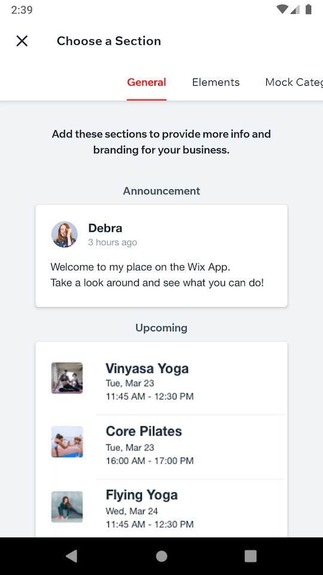

# Taking Screenshots

Detox supports taking in-test screenshots of the device, making the result immediately available in the form of an image file.

Screenshots can be taken in two levels:

- **Device-level:** taking a screenshot of the entire screen.
- **Element-level:** taking a screenshot of a specific element (and the view-hierarchy associated with it), currently appearing on the screen.

In both cases, the concept is mainly useful for verifying the proper visual structure and layout of elements appearing on the device's screen, in the form of a snapshot-test. Namely, by following these conceptual steps:

1. Taking a screenshot, once, and manually verifying it, visually.
2. Storing it as an e2e-test asset (i.e. the _snapshot_).
3. Using it as the point-of-reference for comparison against screenshots taken in consequent tests, from that point on.

```js
const fs = require('fs');

describe('Members area', () => {
  const snapshottedImagePath = './e2e/assets/snapshotted-image.png';

  it('should greet the member with an announcement', async () => {
    const imagePath = (take screenshot from the device); // Discussed below
    expectBitmapsToBeEqual(imagePath, snapshottedImagePath);  
  });  
});

function expectBitmapsToBeEqual(imagePath, expectedImagePath) {
  const bitmapBuffer = fs.readFileSync(imagePath);
  const expectedBitmapBuffer = fs.readFileSync(expectedImagePath);
  if (!bitmapBuffer.equals(expectedBitmapBuffer)) {
    throw new Error(`Expected image at ${imagePath} to be equal to image at ${expectedImagePath}, but it was different!`);
  }
}
```

**Important:** The recommended, more practical way of doing this, is by utilizing more advanced 3rd-party image snapshotting & comparison tools such as [applitools](https://applitools.com).

## Device-level Screenshots

Taking a screenshot of the entire screen can be done using a device-level API:

```js
const imagePath = await device.takeScreenshot('opened general section');
```

The API immediately returns the path of a temporary, readable image file where the screenshot is stored, all-the-while scheduling the transferring of it to the [artifacts folder](APIRef.Artifacts.md#enabling-artifacts) upon completion of the currently running test.

**Returns:**

The path of a temporary file containing the resulted `.png` image.

Important: The returned path is guaranteed to be valid only during the test execution. Later on, the screenshot will be moved to the artifacts location, and will not be available.

**Parameters:**

`name (optional)` - Name of the final image-file to store as the artifact. For example, setting `name` to `opened general section` would result in an artifact file named `opened general section.png`. In case the name isn't provided, Detox would self-generate a random, distinct name, instead (though not a very descriptive one).

### Artifacts Management

Means of creation of the final image as an artifact is tightly connected to the `--take-screenshots` argument to Detox CLI:

* If `--take-screenshots none` is set, the screenshot will be taken, but it won't be saved to `<artifacts-location>` after the test ends.
* If `--take-screenshots failing` is set, and the test passes, the screenshot won't be saved to `<artifacts-location>` after the test ends.
* In the other modes (`manual` and `all`), if the test passes, the screenshot will be put to `<artifacts-location>/✓ Members area should greet the member with an announcement/opened general section.png`.
* In the other modes (`manual` and `all`), if the test fails, the screenshot will be put to `<artifacts-location>/✗ Members area should greet the member with an announcement/opened general section.png`.

### Caveats

This API well-captures all elements, although alongside surrounding "visual noise" such as the navigation bar, as can be seen in the image below:



As the image includes, for example, the current time (at the top-left corner), running the test in any _different_ time would unnecessarily result in an utter comparison failure, making the test downright useless. Fortunately, this can be resolved, by putting the device into "demo mode" (i.e. freezing the irrelevant, volatile elements) . For example (credits - [Miki](https://github.com/M-i-k-e-l)):

```js
async function setDemoMode() {
  if (device.getPlatform() === 'ios') {
    execSync(
      'xcrun simctl status_bar "iPhone 11" override --time "12:00" --batteryState charged --batteryLevel 100 --wifiBars 3 --cellularMode active --cellularBars 4'
    );
  } else {
    // enter demo mode
    execSync('adb shell settings put global sysui_demo_allowed 1');
    // display time 12:00
    execSync('adb shell am broadcast -a com.android.systemui.demo -e command clock -e hhmm 1200');
    // Display full mobile data with 4g type and no wifi
    execSync(
      'adb shell am broadcast -a com.android.systemui.demo -e command network -e mobile show -e level 4 -e datatype 4g -e wifi false'
    );
    // Hide notifications
    execSync('adb shell am broadcast -a com.android.systemui.demo -e command notifications -e visible false');
    // Show full battery but not in charging state
    execSync('adb shell am broadcast -a com.android.systemui.demo -e command battery -e plugged false -e level 100');
  }
}
```

> Note: This script implicitly assumes only one device is used, as device ID isn't specified anywhere (e.g. with `adb -s <id>`).

## Element-level Screenshots (Android Only)

Taking a screenshot of a specific element can be simply done using an API similar to other element-interaction Detox API's:

```js
const imagePath = await element(by.id('announcementsRoot')).takeScreenshot('welcome announcement');
```

> The API works in the exact same way as `device.takeScreenshot()` does in terms of return value, arguments, and artifacts management.

In this example, the image-file specified by `imagePath` will hold the visual content of a native view whose test ID is `announcementsRoot`, alongside all of the views in the view-hierarchy formed by it as the root-view. Visually, this can be, for example:


Meaning, assuming `announcementsRoot` has been specified over some ancestor view which has both the `Announcement` title _and_ the card as its direct or indirect children, the result would include both. That, in turns, also includes the card's children, such as the the avatar, welcome text, etc.

### Caveats of this approach

Focusing on specific elements, this approach is key to more stable comparisons, and hence more stable tests, over time. However, inspecting less content evidently means protecting against less bugs. For example, In a screen where the element in question is partly obstructed by other elements drawn on the screen, the image created by `takeScreenshot()` will successfully hold all of it's content, nonetheless.<sup>*</sup>

Consider this situation in one of the app's screens, where the upcoming schedule overlaps the top-hand announcement card:


Taking an element-screenshot of the announcement part alone, would yield a proper result, leaving this bug overlooked:


Only by taking the element-screenshot of a common ancestor, will this bug be surfaced. However, in turn, that can affect stability, as the result is now sensitive to more details such as padding and background color.

**As a bottom line, this API is mostly suited for testing UI components rather than complete screens.**

---

*\*  Nevertheless, `takeScreenshot()` does crop away any parts of the element that are out of screen bounds.*

