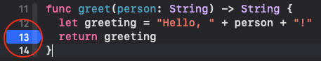

## Debugging in Xcode During Detox Tests

> This is mostly useful for investigating weird crashes or when contributing to Detox itself. **This workflow isn’t standard. Don’t use it unless you have a good reason.**

### Add Detox Framework to Your Project

- Go to `node_modules/detox` and extract `Detox-ios-src.tbz`

  

- Drag `Detox-ios-src/Detox.xcodeproj` into your Xcode project

  

- Go to your project settings → **General** and add **Detox.framework** to **Frameworks, Libraries, and Embedded Content** (make sure **Embed & Sign** is selected under **Embed**)

  

> NOTE: Apps should not be submitted to the App Store with the Detox framework linked. Follow this guide only to debug Detox issues in your project. Once finished, make sure to remove **Detox.framework** from your project.

### Add a "manual" configuration to your `.detoxrc`

Locate your `.detoxrc` config file or the corresponding `detox` section in your `package.json`
and add a configuration similar to this one:

```json
{
  "devices": {
    "simulator": {
      "type": "ios.simulator",
      "device": {
        "type": "<e.g., iPhone 12 Pro>"
      }
    }
  },
  "apps": {
    "ios.debug": {
      "type": "ios.app",
      "binaryPath": "<path to your app binary built before>"
    }
  },
  "configurations": {
    "ios.manual": {
      "device": "simulator",
      "app": "ios.debug",
      "behavior": {
        "launchApp": "manual"
      }
    }
  }
}
```

While the `behavior` section is a **mandatory** thing to include, there are a few more optional
parameters to disable various side effects and make life easier when debugging:

```diff
   "behavior": {
     "launchApp": "manual"
   },
+  "session": {
+    "autoStart": true,
+    "debugSynchronization": 0,
+    "server": "ws://localhost:8099",
+    "sessionId": "test"
+  },
+  "artifacts": false
```

- Using a preconfigured `session` with an autostarting server removes the legwork of copying and
  pasting values to the instrumentation runner launch arguments dialog every time before any launch
  from the IDE. Otherwise, by default when the `session` object omitted, `server` and `sessionId`
  are randomly generated for every new test session.

  - The `debugSynchronization: 0` override matters only if you have a global `session` config
    with `debugSynchronization` set to a positive integer value. Otherwise, it is not needed. The point
    is to disable regular app polling requests during debugging, since that only can hinder the debugging.

- Setting `artifacts: false` override also matters only if you have a global `artifacts` config.
  The motivation is to disable irrelevant taxing activities on the device such as capturing logs
  screenshots, videos and so on.
  - If your investigation addresses a specific artifact plugin glitch on the native side, then just
    disable all the other plugins. See [Detox Configuration](APIRef.Configuration.md) document
    for the reference.

### Run a specific test

Usually, you would want to focus on a specific test suite to save time, e.g.:

```sh
detox test -c ios.manual e2e/someSuite.test.js --testTimeout 999999
```

Forwarding an increased `testTimeout` to Jest (as shown below) is recommended to avoid false timeout errors
which are likely to be thrown if you spend too much time in debugging.

> Also, if there is something you want to do step by step in JS code while debugging native, append
> `--inspect-brk` flag:
>
> ```sh
> detox test -c ios.manual e2e/someSuite.test.js --inspect-brk
> ```
>
> To learn more about debugging with `--inspect-brk`, refer to
> [Debugging — Getting Started](https://nodejs.org/en/docs/guides/debugging-getting-started/)
> on the official Node.js website.

Afterwards, you should see your test suite starting as usual until it reaches the app launch, where
Detox stops instead and prompts you to launch the app from the IDE:

```
detox[16804] INFO:  [SimulatorDriver.js] Waiting for you to manually launch your app in Xcode.
Make sure to pass the launch arguments listed below:
  -detoxServer ws://localhost:8099
  -detoxSessionId com.wix.detox-example

Press any key to continue...
```

You’ll need to run your app with the said arguments from Xcode:


### Launching the app

Before you launch the app, make sure to [put breakpoints](https://developer.apple.com/documentation/xcode/setting-breakpoints-to-pause-your-running-app) at the points of interest, e.g.:



Launch the app with the debugger attached:


The moment you see the app is idle, go back to the Terminal where Detox is running
and press any key. If you wish to terminate the process for some reason, use Ctrl+C.
In a couple of seconds you are expected to see a confirmation from Detox, e.g.:

```plain text
Found the app (com.wix.detox-example) with process ID = 16854. Proceeding...
```

Now the entire test will run as usual until it sends an action to the app, which gets trapped
in your breakpoint. Now, when you are there, we wish you happy debugging!
