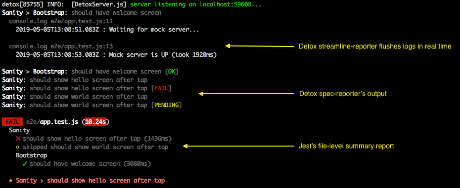

## Jest Setup Guide

> **NOTE: This article previously focused on deprecated `jest-jasmine2` runner setup, and if you nevertheless need to access it, [follow this Git history link](https://github.com/wix/Detox/blob/ef466822129a4befcda71111d02b1a334539889b/docs/Guide.Jest.md).**

This guide describes how to install [Jest](https://jestjs.io) as a test runner to be used by Detox for running the E2E tests.

### Introduction

As already mentioned in the [Getting Started](Introduction.GettingStarted.md#set-up-a-test-runner) guide, Detox itself does not effectively run tests logic, but rather delegates that responsibility onto a test runner. At the moment, Jest is the only recommended choice, for many reasons, including - but not limited to, parallel test suite execution capability, and complete integration with Detox API.

By the way, Jest itself — much like Detox, also does not effectively run any tests. Instead, it is more of a dispatcher and orchestrator of multiple instances of a delegated runner capable of running in parallel. For more info, refer to [this video](https://youtu.be/3YDiloj8_d0?t=2127) (source: [Jest architecture](https://jestjs.io/docs/en/architecture)).

### Installation

**Disclaimer:**

1. Here we focus on installing Detox on _new projects_. If you’re migrating a project with an existing Detox installation, please apply some common sense while using this guide.
1. These instructions are relevant for `jest@^27.2.5` and `jest@28.x.x`. They should likely work for the newer `jest` versions too, but for **the older ones** (26.x, 25.x) — **they will not, due to blocking issues.**

#### 1. Install Jest

Before starting with Jest setup, be sure to complete the preliminary sections of the [Getting Started](Introduction.GettingStarted.md) guide.

Afterward, install the respective npm package:

```sh
npm install -D "jest@>=27.2.5"
```

**NOTE:** The command will install the _latest Jest version_. However, `@>=27.2.5` addendum is recommended just to be on the safe side in a common scenario, when a `package-lock.json`
generated by an official React Native project template limits Jest version to a very old `26.x`, maybe due to some optimization mechanism.

#### 2. Set up Test-code Scaffolds

Run the automated init script:

```sh
detox init -r jest
```

> **Note:** errors occurring in the process may appear in red.

If things go well, the following will be created:

- An `e2e/` folder in your project root
- An `e2e/config.json` file; [example](https://github.com/wix/Detox/tree/master/examples/demo-react-native-jest/e2e/config.json)
- An `e2e/environment.js` file; [example](https://github.com/wix/Detox/tree/master/examples/demo-react-native-jest/e2e/environment.js)
- An `e2e/firstTest.e2e.js` file with content similar to [this](https://github.com/wix/Detox/tree/master/examples/demo-react-native-jest/e2e/app-hello.e2e.ts).

#### 3. Fix / Verify

Even if `detox init` passes well, and everything is green, we still recommend going over the checklist below. You can also use our example project, [`demo-react-native-jest`](https://github.com/wix/Detox/tree/master/examples/demo-react-native-jest), as a reference in case of ambiguities.

##### .detoxrc.json

| Property       | Value                               | Description                                                                                                                             |
| -------------- | ----------------------------------- | --------------------------------------------------------------------------------------------------------------------------------------- |
| `testRunner`   | `"jest"`                            | _Required._ Should be `"jest"` for the proper `detox test` CLI functioning.                                                             |
| `runnerConfig` | (optional path to Jest config file) | _Optional._ This field tells `detox test` CLI where to look for Jest’s config file. If omitted, the default value is `e2e/config.json`. |

A typical Detox configuration in `.detoxrc.json` file looks like:

```json
{
  "runnerConfig": "e2e/config.json",
  "devices": {
    "simulator": {
      "type": "ios.simulator",
      "device": {
        "type": "iPhone 12 Pro Max"
      }
    }
  },
  "apps": {
    "ios.release": {
      "type": "ios.app",
      "binaryPath": "ios/build/Build/Products/Release-iphonesimulator/example.app",
      "build": "<...xcodebuild command...>",
    }
  },
  "configurations": {
    "ios.sim.release": {
      "device": "simulator",
      "app": "ios.release"
    }
  }
}
```

##### `e2e/config.json`

| Property          | Value                             | Description                                                                                                                                                                                                                                                                                                                                                                                 |
| ----------------- |-----------------------------------|---------------------------------------------------------------------------------------------------------------------------------------------------------------------------------------------------------------------------------------------------------------------------------------------------------------------------------------------------------------------------------------------|
| `maxWorkers`      | `1`                               | _Recommended._ It prevents potential overallocation of mobile devices according to the default logic of Jest (`maxWorkers = cpusCount — 1`) for the default workers count. To override it, [use CLI arguments](APIRef.DetoxCLI.md#test), or see [Jest documentation](https://jestjs.io/docs/configuration#maxworkers-number--string) if you plan to change the default value in the config. |
| `testEnvironment` | `"./environment"`                 | _Required._ Needed for the proper functioning of Jest and Detox. See [Jest documentation](https://jestjs.io/docs/en/configuration#testenvironment-string) for more details.                                                                                                                                                                                                                 |
| `testRunner`      | `"jest-circus/runner"`            | _Required._ Needed for the proper functioning of Jest and Detox. See [Jest documentation](https://jestjs.io/docs/en/configuration#testrunner-string) for more details.                                                                                                                                                                                                                      |
| `testTimeout`     | `120000`                          | _Required_. Overrides the default timeout (5 seconds), which is usually too short to complete a single end-to-end test.                                                                                                                                                                                                                                                                     |
| `reporters`       | `["detox/runners/jest/reporter"]` | _Recommended._ Sets up our streamline replacement for [Jest’s default reporter](https://jestjs.io/docs/en/configuration#reporters-array-modulename-modulename-options), which removes Jest’s default buffering of `console.log()` output. That is helpful for end-to-end tests since log messages appear on the screen without any artificial delays.                                       |
| `verbose`         | `true`                            | _Conditional._ Must be `true` if above you have replaced Jest’s default reporter with Detox’s `reporter`. Optional otherwise.                                                                                                                                                                                                                                                               |

A typical `jest-circus` configuration in `e2e/config.json` file would look like:

```json
{
  "testRunner": "jest-circus/runner",
  "testEnvironment": "./environment",
  "testTimeout": 120000,
  "reporters": ["detox/runners/jest/reporter"],
  "verbose": true
}
```

##### `e2e/environment.js`

If you are not familiar with Environment concept in Jest, you could check [their documentation](https://jestjs.io/docs/en/configuration#testenvironment-string).

For Detox, having a `CustomDetoxEnvironment` class derived from `NodeEnvironment` enables implementing cross-cutting concerns such as taking screenshots the exact moment a test function (it/test) or a hook (e.g., beforeEach) fails, skip adding tests if they have `:ios:` or `:android:` within their title, starting device log recordings before test starts and so on.

API of `CustomDetoxEnvironment` is not entirely public in a sense that there’s no guide on how to write custom `DetoxCircusListeners` and override `initDetox()` and `cleanupDetox()` protected methods, since this is not likely to be needed for typical projects, but this is under consideration if there appears specific demand. You may want to check out this [simple example](https://github.com/wix/Detox/pull/2009#issuecomment-648971528) of overriding `initDetox()`, or some [alternative approaches](https://github.com/wix/Detox/pull/2009#issuecomment-649342823) to overriding `initDetox()`.

```js
const {
  DetoxCircusEnvironment,
  SpecReporter,
  WorkerAssignReporter,
} = require('detox/runners/jest');

class CustomDetoxEnvironment extends DetoxCircusEnvironment {
  constructor(config, context) {
    super(config, context);

    // Can be safely removed, if you are content with the default value (=300000ms)
    this.initTimeout = 300000;

    // This takes care of generating status logs on a per-spec basis. By default, Jest only reports at file-level.
    // This is strictly optional.
    this.registerListeners({
      SpecReporter,
      WorkerAssignReporter,
    });
  }
}

module.exports = CustomDetoxEnvironment;
```

**Notes:**

- The custom `SpecReporter` is recommended to be registered as a listener. It takes care of logging on a per-spec basis (i.e. when `it('...')` functions start and end) — which Jest does not do by default.
- The custom `WorkerAssignReporter` prints for every next test suite which device is assigned to its execution.

This is how a typical Jest log output looks when `SpecReporter` and `WorkerAssignReporter` are enabled in `streamline-reporter` is set up in `config.json` and
`SpecReporter` added in `e2e/environment.js`:



### Writing Tests

There are some things you should notice:

- Don’t worry about mocks being used, Detox works on the compiled version of your app.
- Detox exposes its primitives (`expect`, `device`, ...) globally, it will override Jest’s global `expect` object.

### Parallel Test Execution

Through Detox' CLI, Jest can be started with [multiple workers](Guide.ParallelTestExecution.md) that run tests simultaneously, e.g.:

```bash
detox test --configuration <yourConfigurationName> --workers 2
```

In this mode, Jest effectively assigns one worker per each test file.
Per-spec logging offered by the `SpecReporter` mentioned earlier, does not necessarily make sense, as the workers' outputs get mixed up.

By default, we disable `SpecReporter` in a multi-workers environment.
If you wish to force-enable it nonetheless, the [`--jest-report-specs`](APIRef.DetoxCLI.md#test) CLI option can be used with `detox test`, e.g.:

```bash
detox test --configuration <yourConfigurationName> --workers 2 --jest-report-specs
```

### How to Run Unit and E2E Tests in the Same Project

- Create different Jest configs for unit and E2E tests, e.g. in `e2e/config.json` (for Detox) and `jest.config.js`
  (for unit tests). For example, in Jest’s E2E config you can set `testRegex` to look for `\.e2e.js$` regexp,
  and this way avoid accidental triggering of unit tests with `.test.js` extension.
- To run your E2E tests, use `detox test` command (or `npx detox test`, if you haven’t installed `detox-cli`).
