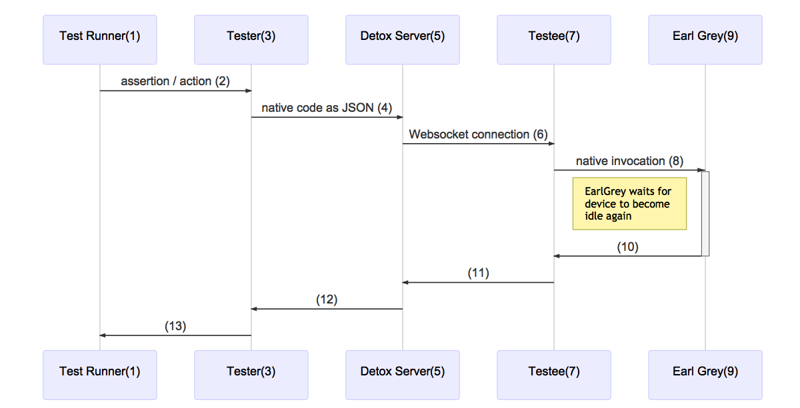

Detox is an end-to-end testing framework. This means it runs your app on an actual device/simulator and interacts with it just like a real user would. This type of tests can give a lot of confidence for releasing your app and help automate a manual QA process. If you're coming from a web background, it's very similar in concept to [protractor](http://www.protractortest.org/#/).

When a Detox test executes, you actually have two different parts running side by side:

* **The mobile app itself.** Usually running on a simulator. Real devices will also be supported soon. A regular native build of your app is installed and executed on the device. Your app is usually built once before the tests start running.

* **The test suite.** Running on Node.js using a test runner like Mocha. The tests are normally written in JavaScript. This part is running outside the app and communicates with the app on the device over the network using a websocket (HTTP). Because the tests are asynchronous in nature (every test line requires to access the app and wait for a response), the tests rely heavily on [async-await](https://ponyfoo.com/articles/understanding-javascript-async-await).

The two parts are usually running in separate processes on your machine. It is also possible to run the two parts on different machines. Communication between the two parts takes place over the network using a websocket.

In practice, to make the communication more resilient, both parts are implemented as clients and communicate with a Detox server that acts as proxy. This allows some nice behaviors like allowing one side to disconnect (during a simulator boot for example or app restart) without disconnecting the other side and losing its state.

### How Detox Automatically Synchronizes With Your App

One of the key features of Detox is its ability to automatically synchronize the test execution with your app. The most annoying aspect of end-to-end tests is flakiness - tests sometimes fail without anything changing. Flakiness happens because tests are nondeterministic. Every time a test is running, things take place in a slightly different order inside your app. 

Consider a scenario where the app is making multiple network requests at the same time. What is the order of execution? It depends on which request completes first. This is an external concern depending on network congestion and how busy the server is.

The traditional method of dealing with flakiness is adding various "sleep" commands throughout the test in an attempt to force a certain execution order. This is a bad practice riddled with fragile magic values that often change if the machine running the tests becomes faster or slower.

Detox eliminates flakiness by automatically synchronizing your tests with the app. A test cannot continue to the next line if the app is busy. The test will only resume when the app becomes idle. Detox monitors your app very closely in order to know when it's idle. It tracks several asynchronous operations and waits until they complete. This includes:

* Keeping track of all network requests that are currently in-flight and waiting until they complete
* Keeping track of pending animations and waiting until they complete
* Keeping track of timers (like `setTimeout`) and waiting until they expire
* Keeping track of the React Native bridge which carries asynchronous messages
* Keeping track of asynchronous React Native layout and the shadow queue
* Keeping track of the JavaScript event loop which may contain pending asynchronous actions

### Architecture
The sequence diagram below shows the general communication scheme between the components in Detox.

To understand this topic more thoroughly we need to have a look at an example action in detail. The numbers in the listing below correlate with the ones in the diagram.

### Action (`element.tap`)

1. `element.tap()` in your test case is invoked.
2. `TapAction` in [`expect.js`](https://github.com/wix/detox/blob/master/detox/src/ios/expect.js) gets invoked
3.  `TapAction` instance gets passed to [`invoke.js`](https://github.com/wix/detox/blob/master/detox/src/invoke.js), where it gets transformed to JSON. The resulting JSON correlates more with the native code than with the JS code for better extensibility.
4. JSON gets send to detox-server by [`Client.js`](https://github.com/wix/detox/blob/master/detox/src/client/Client.js)
6. detox-server forwards it to the testee in [`DetoxServer.js`](https://github.com/wix/detox/blob/master/detox-server/src/DetoxServer.js)
7. [`DetoxManager.m`](https://github.com/wix/detox/blob/master/detox/ios/Detox/DetoxManager.m) invokes the [`TestRunner.m`](https://github.com/wix/detox/blob/master/detox/ios/Detox/TestRunner.m). `TestRunner.m` uses [`MethodInvocation.m`](https://github.com/wix/detox/blob/master/detox/ios/Detox/MethodInvocation.m) to map the JSON representation of the native commands into the actual native command and executes it. *(8)*

*NOTE: the images can be updated with [mermaid](http://knsv.github.io/mermaid/#mermaid). The files can be found under `img-src`*
