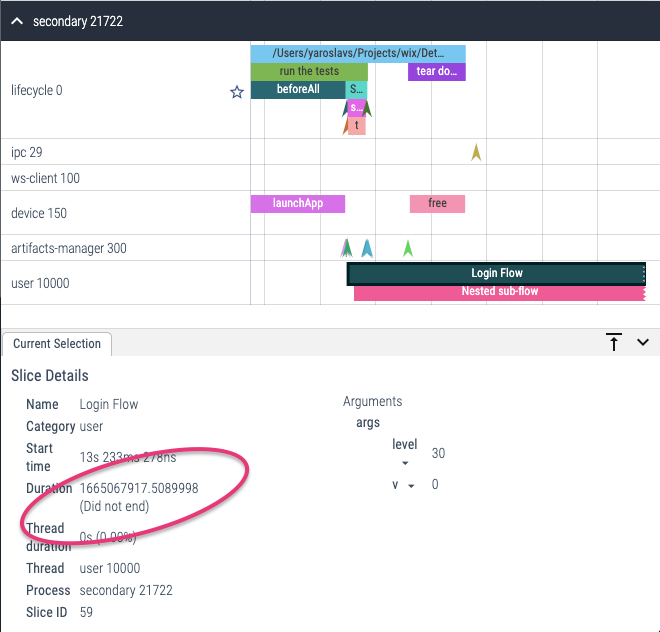
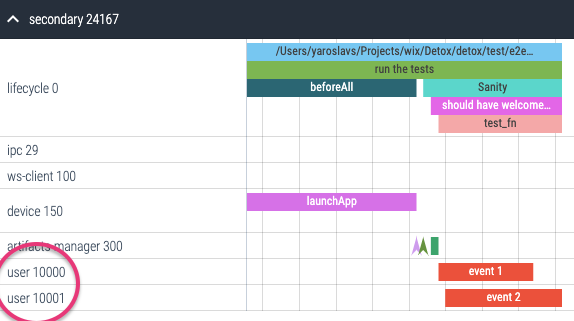

# Logger

Detox Logger API allows you to save your custom messages and events alongside the built-in ones.
In addition to being formatted and printed to the console, they can be preserved as log artifacts if you enable them via [`--record-logs`] CLI option or [`artifacts.plugins.log.enabled`] in the config:

- `<artifacts-location>/detox.log` – plain text log;
- `<artifacts-location>/detox.trace.json` – [Trace Event format] file, viewable via [Perfetto] or `chrome://tracing`.


Below we’ll be listing all the public properties and methods of the logger.

## Properties

### `log.level` \[enum]

**Read-only.** Returns the current [log level](../config/logger.mdx#loggerlevel-enum), one of values:
`fatal`, `error`, `warn`, `info`, `debug`, `trace`.

## Methods

### `log.*([event,] ...msg)`

Logs an instant message with an optional [event metadata].
There are six methods for producing log messages varying by log level:

* `log.fatal([event,] ...msg)`
* `log.error([event,] ...msg)`
* `log.warn([event,] ...msg)`
* `log.info([event,] ...msg)`
* `log.debug([event,] ...msg)`
* `log.trace([event,] ...msg)`

Example:

```js
const { log } = require('detox');

log.info('Some message');
// detox[2020] i Some message

log.error({ err: new Error('Test') }, 'An error message');
// detox[2020] i An error message
//   err: Test
```

### `log.*.begin([event,] msg)`

Logs a beginning of a _duration event_ with an optional [event metadata].
Duration events are displayed as continuous colorful segments on the timeline and can be stacked if you
call the method multiple times, e.g.:

```js
log.info.begin({ data: { email } }, 'Login Flow');
// detox[2020] B Login Flow
//   data: { email: 'tester@example.com' }
log.info.begin('Nested sub-flow');
// detox[2020] B Nested sub-flow
```

Make sure you always end your events so that they don't get marked as unfinished, like shown on the screenshot below:



### `log.*.end([event, msg])`

Logs an end of a duration event with an optional [event metadata] and a message. If the message is omitted,
the logger prints the corresponding message from the duration begin event:

```js
log.info.end();
// detox[2020] E Nested sub-flow
log.info.end({ success: true }, 'Login Flow (custom end message)');
// detox[2020] E Login Flow (custom end message)
```

### `log.*.complete([event,] msg, functionOrPromise)`

A convenience method to wrap functions and promises with [`log.*.begin`] and [`log.*.end`], e.g.:

```js
await log.info.complete('Login Flow', async () => {
  // …
});
// detox[2020] B Login Flow
// detox[2020] E Login Flow
```

As a bonus, this wrapper also adds `{ success: true }` or `{ success: false, error }` metadata to
the end event.

Effectively, `begin` and `end` can even be called in two complete different places - such as `beforeEach` and `afterEach`, but that is discouraged.

In fact, `log.*.complete()` is the recommended way of tracing things, e.g.:

## Event metadata

All the log methods accept an optional first argument which can contain some custom
metadata: numbers, strings and booleans:

```js
detox.log.info({ /* metadata */ }, message);
detox.log.trace.begin({ /* metadata */ }, message);
detox.log.trace.end({ /* metadata */ });
```

Aside from custom user properties, there are a few meaningful properties that affect the timeline representation.

### `id` \[string \| number]

Use arbitrary IDs when you have a risk of overlapping concurrent events, e.g.:

```js
await Promise.all([
  await detox.log.complete({ id: 1 }, 'Do this', async () => { /* … */ }),
  await detox.log.complete({ id: 2 }, 'Do that', async () => { /* … */ }),
]);
```

Using IDs will prevent situations like this, where the nested event outlasts its parent:

```plain text
B               E
|-- event 1 ----|
   B                E
   |-- event 2 -----|
```

In the example above, the actual sequence of calls will be:

```js
log.info.begin('event 1');
log.info.begin('event 2');
log.info.end(); // from event 1
log.info.end(); // from event 2
```

Therefore, it will be interpreted erroneously on the timeline, as if the second event has ended before the first one:

```plain text
B                   E
|-- event 1 --------|
   B            E
   |-- event 2 -|
```

When you begin an event with a specific `id` while there's already some other duration event, the logger allocates another "lane" for that event by assigning a distinct `tid` (thread ID) to it:



### `cat` \[string \| string\[]]

Event category. Helpful for filtering specific events.

Pass either a string of comma-separated values or a string array, e.g.:

```js
log.info({ cat: 'login,login-email' }, 'Starting e-mail login flow...');
// is identical to:
log.info({ cat: ['login', 'login-email'] }, 'Starting e-mail login flow...');
```

### `cname` \[string]

Custom event color. See the available color names [here](https://github.com/catapult-project/catapult/blob/main/tracing/tracing/base/color_scheme.html).

### `*` \[string \| number \| boolean]

Your custom properties, e.g.:

```js
detox.log.info({ login: 'test@example.com' }, 'Entering credentials...');
```

Custom properties are not printed to the terminal logs, but there are a few reserved names which have
an extra formatting due to our default [`logger.options.stringifiers`] — these are: `args`, `data`, `error`, `stack`, `origin`.

Also, there are a few reserved properties which cannot be logged:
- `pid` — process ID,
- `tid` — thread ID,
- `ts` — timestamp,
- `ph` — phase: _begin_ (B), _end_ (E), _instant_ (i) event.

## Artifacts

The logger subsystem produces two artifacts when [`--record-logs`] CLI option is enabled or [`artifacts.plugins.log.enabled`] config is set to true.

### `detox.log`

This file contains all the log messages you could see in the terminal window, except that there are messages of all the log levels, from `fatal` to `trace`.

### `detox.trace.json`

JSON file, which, if loaded into [Perfetto] or `chrome://tracing` (internal address in Google Chrome browser), would look something like this:


The tracing view provides a visual, hierarchical representation of the various processes that took place during the execution of the testing session, over the execution’s _time-line_. These processes appear as hierarchical _sections_ – sometimes visually ordered in a parent-child way, depending on their formation time and context.

[`log.*.begin`]: #logbeginevent-msg
[`log.*.end`]: #logendevent-msg
[`logger.options.stringifiers`]: ../config/logger.mdx#loggeroptions-bunyandebugstreamoptions
[`--record-logs`]: ../cli/test.md
[`artifacts.plugins.log.enabled`]: ../config/artifacts.mdx#example
[Trace Event format]: https://docs.google.com/document/d/1CvAClvFfyA5R-PhYUmn5OOQtYMH4h6I0nSsKchNAySU/preview
[Perfetto]: https://ui.perfetto.dev
[Event metadata]: #event-metadata
