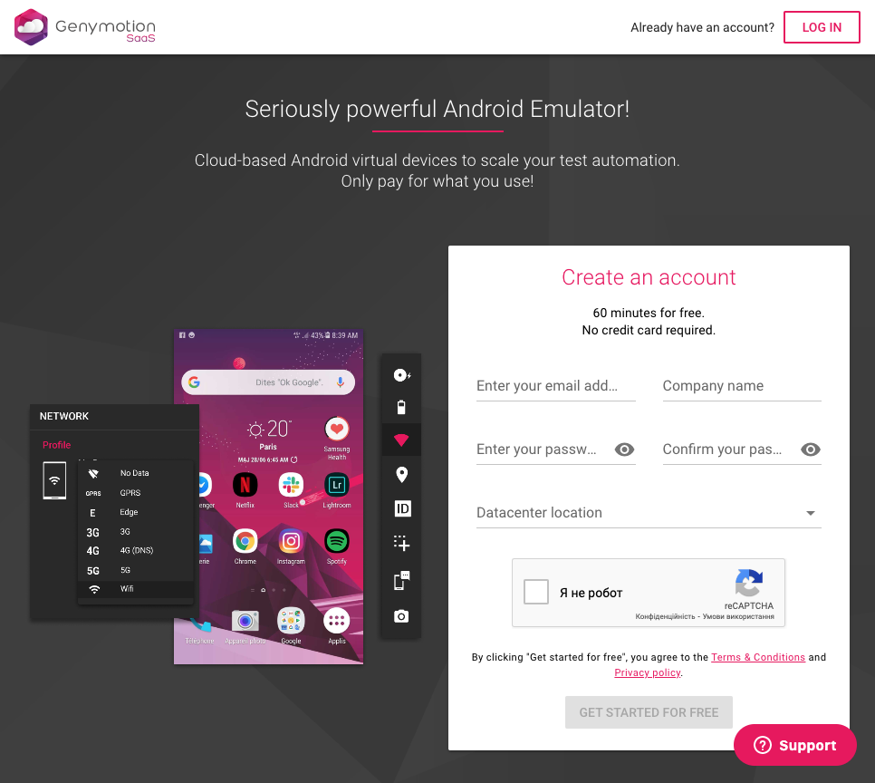
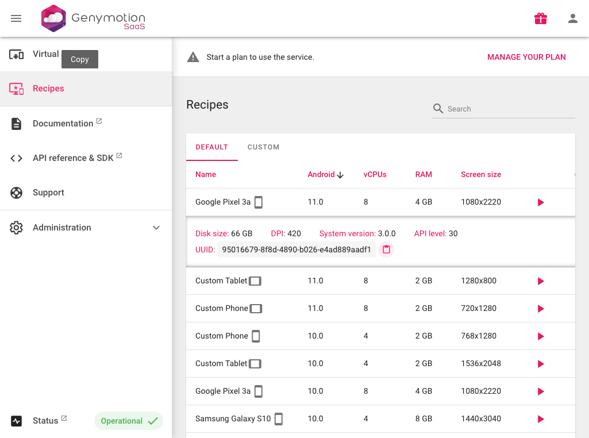

# Using Genymotion SaaS

As the number of your end-to-end tests grows, the overall test session duration might easily surpass an hour or two.
A good idea first would be to parallelize the test execution using your test runner (e.g. for Jest that
would be forwarding `--maxWorkers <N>`), but this approach has its limitations. Indeed, an average build agent would handle
running a few virtual devices at once, but running a dozen devices at once would make it slow and unreliable.

In other words, if you're experiencing scaling issues or struggling with managing local Android emulators,
a good idea would be to migrate to SaaS platforms, where you can start and stop devices on demand at any scale.
At the moment, Detox can offer you a first-class integration with
[Genymotion SaaS], the platform that offers cloud-based Android Virtual Devices.

## Prerequisites

You need to register an account in [Genymotion SaaS], so that you have valid credentials to use with their CLI tool,
[`gmsaas`]. If you already have an account there, make sure there are available device minutes. Don't worry about
the new accounts – they come with **2** concurrent devices and free **60** minutes out of the box.



Next, you should get `gmsaas` CLI tool [installed and configured][Genymotion SaaS tutorial],
so that you're able to see your e-mail after running this:

```bash
gmsaas auth whoami
# your_email@example.com
```

If you encounter errors instead, please revisit the [Genymotion SaaS tutorial] and check out their [Known Issues]
section if your problem persists.

## Configuring

To run tests on a device, you need to define its properties first: OS version, screen dimensions, etc.
This entire set of device specs is called a **recipe**. Genymotion SaaS offers you a predefined list of recipes
to pick from, but you can create custom recipes as well. Refer to the [Basic Steps] tutorial on their website for
more details.



Each recipe item in the list can be expanded for extra details, and that's where you can find its respective _UUID_.
Copy that UUID and use it to create a new device and a new configuration in your Detox config:

```diff title=".detoxrc.js"
 module.exports = {
   devices: {
     simulator: { /* ... */ },
     emulator: { /* ... */ },
+    genycloud: {
+      type: 'android.genycloud',
+      device: {
+        recipeUUID: '<paste your chosen recipe UUID>'
+      },
+    },
   },
   apps: {
     'ios.debug': { /* ... */ },
     'ios.release': { /* ... */ },
     'android.debug': { /* ... */ },
     'android.release': { /* ... */ },
   },
   configurations: {
     'ios.debug': { /* ... */ },
     'ios.release': { /* ... */ },
     'android.debug': { /* ... */ },
     'android.release': { /* ... */ },
+    'android.genycloud.release': {
+      device: 'genycloud',
+      app: 'android.release',
+    },
   },
 };
```

Although the _recipe UUIDs_ are guaranteed to be unique and never change unlike the _recipe names_, you still can use
the latter if you like – just switch from `recipeUUID` to `recipeName` property like this:

```diff
     genycloud: {
       type: 'android.genycloud',
       device: {
-        recipeUUID: '<delete your recipeUUID property>'
+        recipeName: '<paste the recipe name>'
       },
     },
   },
```

:::info

In the example above we assume you'll be running a _release configuration_ of your app since this is what
usually happens on CI.

Running _debug builds_ is trickier to set up (and might be less stable), but if you have to do it,
follow the instructions. You'll be setting up tunneling between your local machine (where React Native packager is
running on port 8081) and the remote device in the cloud.

First, patch your `MainApplication.java` (or your main activity class) to override `debug_http_host`, e.g.:

```diff
 package com.example;

 import android.app.Application;
+import android.content.SharedPreferences;
+import android.os.Bundle;
+import android.preference.PreferenceManager;

 import com.facebook.react.ReactApplication;
 import com.facebook.react.ReactNativeHost;
@@ -37,6 +40,9 @@ public class MainApplication extends Application implements ReactApplication {
     public void onCreate() {
         super.onCreate();
         SoLoader.init(this, /* native exopackage */ false);
+        SharedPreferences preferences =
+            PreferenceManager.getDefaultSharedPreferences(getApplicationContext());
+        preferences.edit().putString("debug_http_host", "localhost:8081").apply();
     }

 }
```

Now, as your React Native app will be forced to use `localhost:8081` to download the bundle, you'll need to make sure
that there is a tunnel between your local machine and the remote device – add 8081 to `reversePorts` in your app config,
e.g.:

```diff
  'android.debug': {
    type: 'android.apk',
    binaryPath: 'android/app/build/outputs/apk/fromBin/debug/app-fromBin-debug.apk',
    build: 'cd android && ./gradlew assembleFromBinDebug assembleFromBinDebugAndroidTest -DtestBuildType=debug && cd ..',
+   reversePorts: [8081],
  },
```

Clean your Android build intermediates and build your app again:

```bash
cd android
./gradlew clean # remove ./ on Windows
cd ..
detox build -c android.emu.debug
```

If your application is trivial enough, these adjustments should be already enough to run _debug builds_ remotely.

:::

## Running

Assuming you have created a new `android.genycloud.release` configuration, run:

```bash
detox test -c android.genycloud.release
```

Soon enough you'll be seeing an output like this:

```
Allocating Genymotion-Cloud instance Detox.62dfc57b-3201-c861-29bb-8f31f60a8d39.w1 for testing.
To access it via a browser, go to: https://cloud.geny.io/instance/8fc62d21-3de0-4ed8-bf18-e69b90246dc5
```

Use the link to see what's happening on your device in real time:


After that, try running tests with 2 workers to make sure that your tests don't have issues with
concurrency. The latter might happen if different test files are fighting over the same resource
(e.g. deleting an account while another test is using it, and so on):

```bash
detox test -c android.genycloud.release --maxWorkers 2
# DETOX_CONFIGURATION="android.genycloud.release" jest --config e2e/jest.config.js --maxWorkers 2
# …
```

:::info

Free Genymotion SaaS accounts are limited to **2** concurrently running devices.
If you need more devices or more minutes for testing, you can reach Genymotion's team
at <sales@genymobile.com>.

:::

## Caveats

### Termination

If you have to terminate your tests execution via `Ctrl+C` or another forcible way, pay attention to
the warnings printed, e.g.:

```plain text
detox[22314] i WARNING! Detected a Genymotion SaaS instance leakage, for the following instances:
detox[22314] i Instance Detox.1e0ee8a4-6949-90c7-6680-5c3a9010d1e5.w1 (8fc62d21-3de0-4ed8-bf18-e69b90246dc5)
    Kill it by visiting https://cloud.geny.io/instance/8fc62d21-3de0-4ed8-bf18-e69b90246dc5, or by running:
    gmsaas instances stop 8fc62d21-3de0-4ed8-bf18-e69b90246dc5
```

Leaving the device unattended would mean spending extra money :grimacing: :dollar:, so make sure to follow the
instructions and stop your instances, e.g.:

```bash
gmsaas instances stop 8fc62d21-3de0-4ed8-bf18-e69b90246dc5
```

:::tip

You can set up a safeguard for the [maximum run duration](https://docs.genymotion.com/saas/05_Administration_interface/#maximum-run-duration)
on the [Administration > Settings](https://cloud.geny.io/administration/settings) panel. This can minimize the costs
even if you accidentally leave the device powered on.

:::

We plan to improve this behavior and secure emergency teardown someday, but beforehand the next issue
should be resolved (see it below). Besides, `Ctrl+C`'ing proves to be useful when you want to leave the device active
at some point of your test scenario and interact with it manually.

### `behavior.shutdownDevice` cannot be disabled

Detox CLI has [`-u, --cleanup` argument], and the behavior config has the respective [`shutdownDevice` property], but **none of them can be effectively disabled** on Genymotion SaaS devices.
Detox _always shuts them down_ in the end of the test session, unless you abruptly terminate its execution (see the previous caveat).

In other words, you can't leave Genymotion SaaS devices up and running after your test session ends. On the ond hand,
that reduces your chances to forget a running device. On the other hand, that doesn't allow you to keep a pool of
immediately ready devices – a kind of strategy that could be more efficient for busier CI pipelines. There are plans
to improve this in the future, but currently you have to bare with this caveat.

[Genymotion SaaS]: https://cloud.geny.io/
[`gmsaas`]: https://docs.genymotion.com/gmsaas
[Genymotion SaaS tutorial]: https://docs.genymotion.com/gmsaas/01_Get_Started
[Known Issues]: https://docs.genymotion.com/gmsaas/04_Issues/
[Basic Steps]: https://docs.genymotion.com/saas/04_Basic_Steps/
[`-u, --cleanup` argument]: ../cli/test.md
[`shutdownDevice` property]: ../config/behavior.mdx
