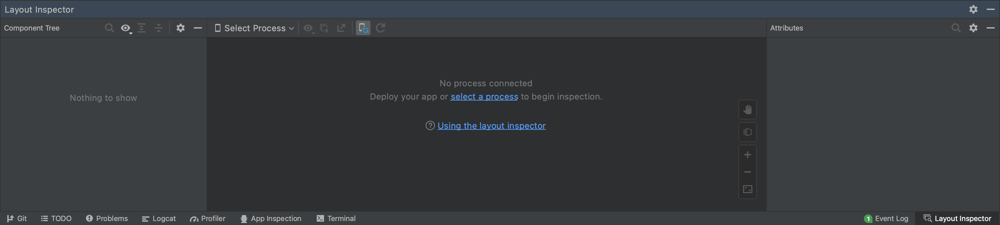

### 1. Launch Android studio

### 2. Open layout inspector tool

Go to `Tools` > `Layout Inspector`.

### 3. Build your application from Android studio

:::caution
Before building your app make sure Metro is running in case of React Native application. If not you can start it with `npx react-native start`.
:::

Once you will build your app from Android studio `Layout Inspector` should automatically attach to the process and show the hierarchy of your screen. You will see the snapshot of your screen with option to click on each component.

:::info Note
In case `Layout Inspector` doesn't attach to process from Android Studio or you build it in a different way - you can select the process to attach to manually in `Select Process` dropdown.
:::

### 4. Select the component

Last thing to do - select the component you need and you will see your actual testID value under the `tag` attribute.

