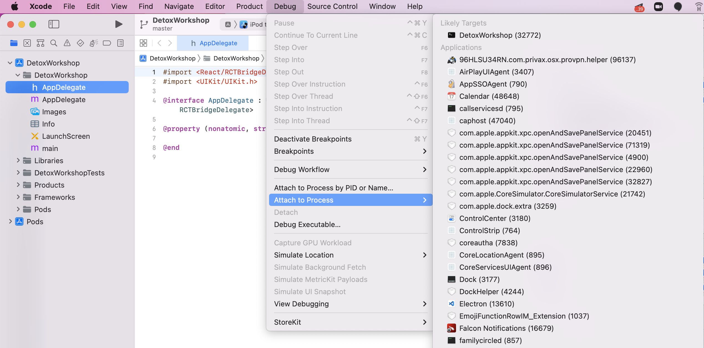
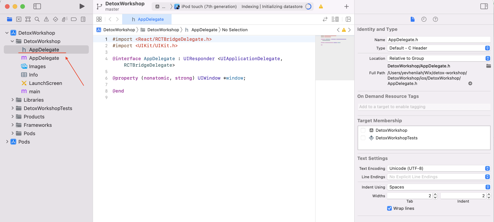
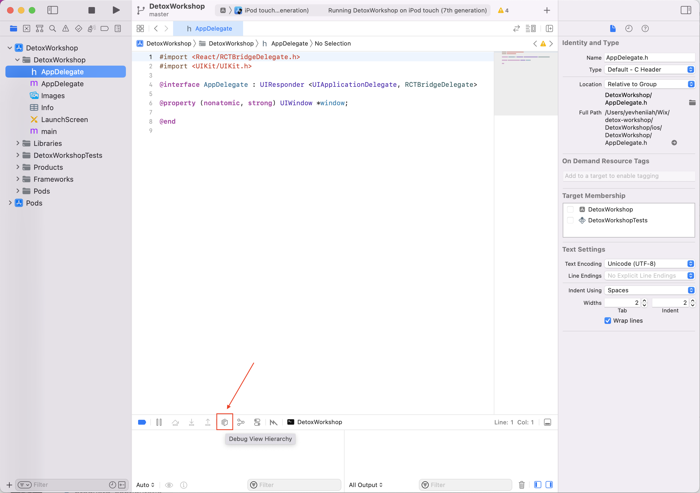
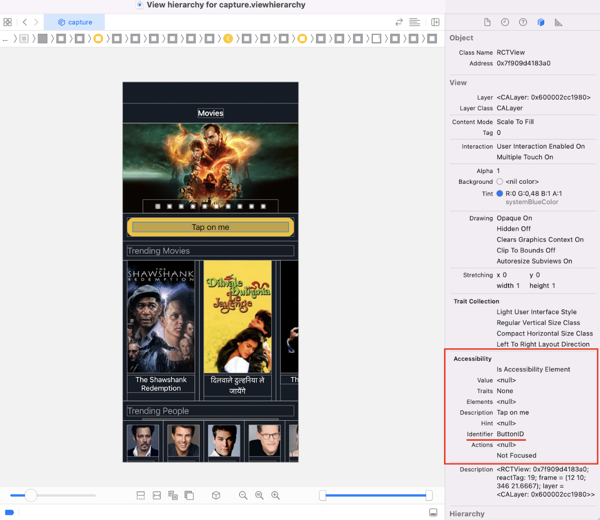

### 1. Start your app in debug mode

First step is to build and start your app in `debug` mode as you usually do, for example:

```sh
detox build -c <ios debug configuration name>
npx react-native start
npx react-native run-ios
```

### 2. Open your project in XCode

Open your iOS project (iOS folder for React Native) in XCode.

### 3. Attach to process

Go to Debug > Attach to process > Select the needed process, in most cases you will see it in the top. You will see new device started with your app.



### 4. Open AppDelegate file



### 5. Click Debug View Hierarchy button



### 6. Select the component

Last thing to do - select the component you need and you will see your actual testID value under the `Accessibility Identifier` attribute.


