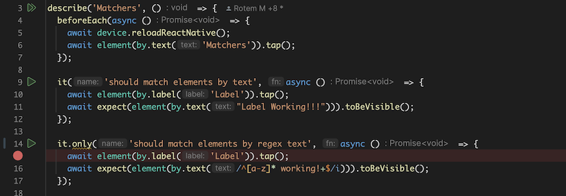
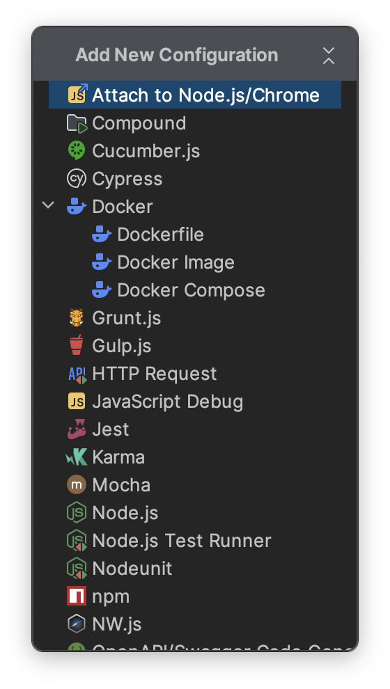
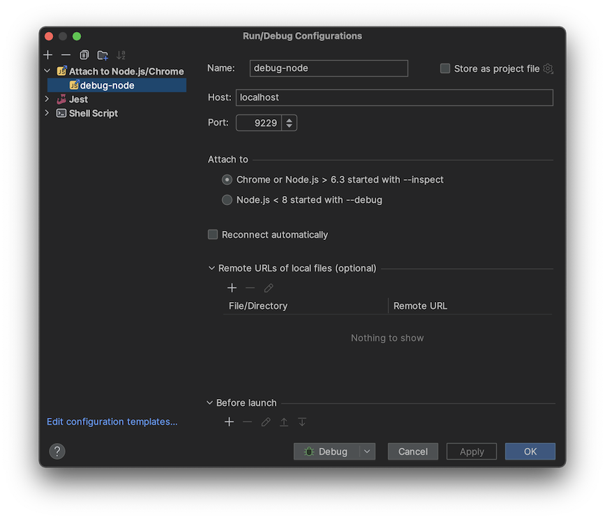
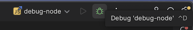
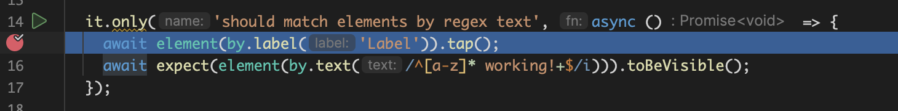

Open your app project (where there tests are, among other things) on Webstorm.

#### Set up a breakpoint

Open the file where the test you wish to run is. Mark it as `it.only`, and set up a breakpoint in a line that suites your needs (note: This can actually be inside a helper function or a test-driver's function):

#### Create+Run a debug configuration

Go to Webstorm's [`Edit Configurations`](https://www.jetbrains.com/help/webstorm/run-debug-configuration.html).

Tap the `+` button and select the Node.js option:

Create a new debugging configuration using the default arguments (port 9229, etc.):

Attach to Detox by "debugging" the new configuration (start it using the beatle button).

Let Detox run until stopped at the break-point:

Run step-by-step using Webstorm's debugging actions (step-over, step-into, etc.) :thumbsup:

