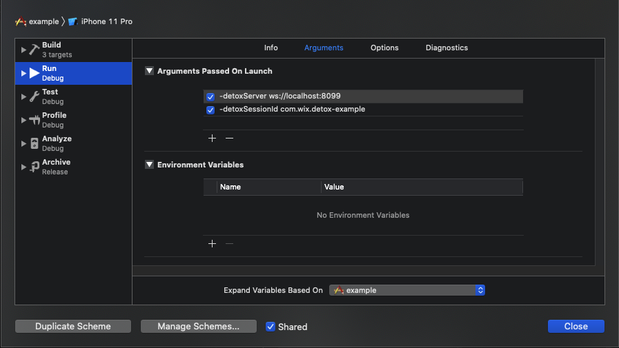
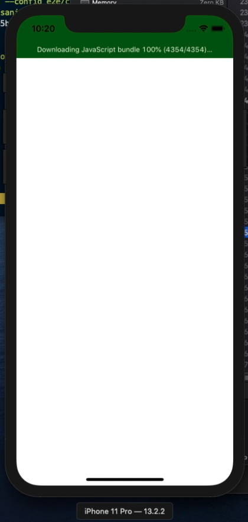

```plain text
18:26:07.024 detox[45214] i Waiting for you to manually launch your app in Xcode.
Make sure to pass the launch arguments listed below:
  -detoxServer ws://localhost:8099
  -detoxSessionId com.wix.detox-example

Press any key to continue...
```

You’ll need to run your app with the said arguments from Xcode:



Before you launch the app, make sure to [put breakpoints](https://developer.apple.com/documentation/xcode/setting-breakpoints-to-pause-your-running-app) at the points of interest, e.g.:


Launch the app with the debugger attached:



The moment you see the app is idle, go back to the Terminal where Detox is running
and press any key. If you wish to terminate the process for some reason, use Ctrl+C.
In a couple of seconds you are expected to see a confirmation from Detox, e.g.:

```plain text
Found the app (com.wix.detox-example) with process ID = 16854. Proceeding...
```

Now the entire test will run as usual until it sends an action to the app, which gets trapped
in your breakpoint.

Happy debugging!

