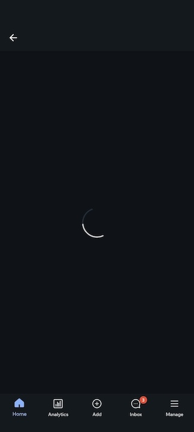
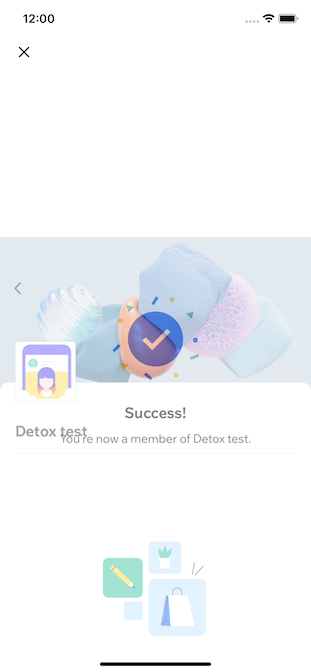

# Dealing With Problems With Running Tests

<!-- markdownlint-disable MD024 -->

This page is about issues related to executing your Detox tests, typically triggered when running `detox test` (and not `detox build`, for example).

## No simulators/emulators found

### iOS

In order to run tests on a simulator, you need to have simulator images installed on your machine. This process is performed by `xcode` itself. You can list all available simulators using `simctl` by typing `xcrun simctl list` in terminal.

If you’re missing a simulator, you need to [manually install it](https://developer.apple.com/documentation/safari-developer-tools/adding-additional-simulators). Note that `xcode` is required.

Once the desired simulator is installed and returned by `xcrun simctl list`, double check its name in the list and make sure this name is found in the `detox` configuration entry in `package.json`. The reference for the configuration options is available [here](../config/devices.mdx).

### Android

Coming soon...

## Detox starts but my test doesn't actually run

### Issue

- A while after running Detox, things seem to hang and you get a message about a failure to connect to the running app, in Detox's logs:

```plain text
Detox can’t seem to connect to the test app(s)!
```

### Course of action

This can be a result of various reasons. It is generally up to you to debug and find the root cause. In any case, below are the common ones.

#### If you don't see your app running on the device

- You might have forgotten to run `device.launchApp()` in the beginning of your test.
- The app might have crashed before Detox has had a chance to connect to it. To get the crash details, you can run Detox tests with `--record-logs all` CLI option and then inspect the device logs in the artifacts' folder.
- **On Android**, there might be a problem with the native test code in the `DetoxTest.java` file. Revisit the [associated section](../introduction/project-setup.mdx#step-4-additional-android-configuration) in the setup guide.
- **On Android**, your `Network Security Config` may not be recognized. Revisit the [associated section](../introduction/project-setup.mdx#43-enabling-unencrypted-traffic-for-detox) in the setup guide.

**If you _do_ see your app running on the device**

- **On Android with SDK≥28**, the app’s connection to the Detox test server is blocked due to clear-traffic blockage (as reported in issue [#1450](https://github.com/wix/Detox/issues/1450)).
  The main step for getting this fixed is to revisit the [associated section](../introduction/project-setup.mdx#step-4-additional-android-configuration) in the setup guide, which discusses network-security. Alternatively, the `android:usesCleartextTraffic="true"` attribute can be configured in the `<application>` tag of the app’s `AndroidManifest.xml`, but **that is highly discouraged**.
- If you’ve applied the above suggestion but the app fails to connect to the Detox test server, nonetheless: Refer to the device’s logs, which should contain messages about failed connection attempts (get them using the `--record-logs all` argument)
- The app could be running without Detox native code injected. In this case, first, make sure you’re not trying to run in manual launch mode (where this behavior is valid). If so, examine the logs from the device (get them using the `--record-logs all` argument). If you see a crash related to Detox’s native code, you are welcome to report it on our GitHub tracker.
- Try reading our [Debugging tutorial](../introduction/debugging.mdx).

## The test runs but the app looks stuck / test times-out

### Issue

- **The test runs and at some point the app gets stuck on the same screen / state until the end of the test** - for example, displaying a loader animation. This can be observed directly if Detox is run locally, or otherwise post-factum by checking Detox's [video recording artifact](https://wix.github.io/Detox/docs/config/artifacts/#enabling-artifacts):
  
  
  
- Detox logs might also show synchronization warnings, repeatedly. For example:

  ```plain text
  19:07:20.140 detox[1907] i The app is busy with the following tasks:
  • UI elements are busy:
    - View animations pending: 2.
    - Layers pending animations: 7.
    - Layers needs layout: 147.
    - View needs layout: 98.
    - View needs display: 67.
    - Layers needs display: 82.
  • 1 enqueued native timers:
    - Timer #1:
      + Fire date: none.
      + Time until fire: 0.000.
      + Repeat interval: 0.
      + Is recurring: YES.
  • 1 network requests with URLs:
    - URL #1: https://example.org/something?id=1337
  ```

- The test failure reason might be associated with time-outs, or you see time-outs in the _device_ (not Detox) log (available as a Detox [test artifact](https://wix.github.io/Detox/docs/config/artifacts/#enabling-artifacts)).

### Course of action

This might be related somehow to your test code, but **could definitely stem from a an app bug.** Take an in-depth look at the [synchronization troubleshooting guide](./synchronization.md).

## Detox can't find or interact with an element even though it's on the screen

### Issue

Either one of the following 2 scenarios:

1. The test runs, the app starts on the device and is maybe even being successfully navigated-through by the test, onto an inner screen; The app/screen opens properly and you know for sure that your element matcher is spot-on - **yet Detox says the element cannot be found (this can even happen intermittently, in a flaky test).**
2. The test runs, the app starts and displays a transient UI element for a limited amount of time and is then removed automatically. For example: A _Toast_ element. Another example: A temporary "Success" cheering-effect that fades out to the screen below:

   

### Course of action

For the 1st option, you'd have to go deeper by exploring the possibility of disabling auto-synchronization as explained in the [synchronization troubleshooting guide](./synchronization.md#last-resort-Switching-to-manual-synchronization).

As for the 2nd option -

1. If possible, start by revisiting your matching technique, as explained in the dedicated [matching troubleshooting guide](./element-matching.md).
2. If that doesn't solve it, consider switching to using `waitFor()` (see below).
3. If all fails, consider [disabling synchronization](./synchronization.md#last-resort-Switching-to-manual-synchronization) altogether.

#### Switching to the polling-based `waitFor()` API's

you'd have to resort to Detox's fail-safe `waitFor()` family of API's, which poll your matching criteria within a specified time frame defined by you as a timeout. To take the screen above as an example, you'd have to change your test from:

```js
await element(by.id('join-button')).tap();
await expect(element(by.text('Success!'))).toBeVisible();
```

to something like:

```js
await element(by.id('join-button')).tap();
await waitFor(element(by.text('Success!'))).toBeVisible().withTimeout(2_000);
```

## Detox says an element is not visible enough

**On iOS**, you may run in a situation, when one of the interactions (tap, scroll, etc.) on an element fails with an error like:

```plain text
Test Failed: View "<RCTScrollView: 0x7f8d32296d70>" is not visible: view does not pass visibility threshold (0% visible of 75% required)
```

1. Try retrieving `ui.viewhierarchy` artifact — sometimes examining the hierarchy visually can give you insights.
   Add a line `"uiHierarchy": "enabled"` to your artifacts' configuration in `.detoxrc.js`, like in an example here: [Artifacts Configuration](../config/artifacts.mdx). After a rerun, you should find
   a `ui.viewhierarchy` in a folder of your failing test. Please mind that you need Xcode 12 at least to open `*.viewhierarchy` files.

1. Besides, you can rerun your iOS app tests with `--take-screenshots failing`. What will happen is, for each view that fails visibility, two images will be saved at `artifacts/<configuration-timestamp-dir>/<test name>/DETOX_VISIBILITY_<viewType>__<viewID>__SCREEN.png` (and `.../DETOX_VISIBILITY_<viewType>__<viewID>__TEST.png` folder aside) with autogenerated names, e.g. `DETOX_VISIBILITY_RCTTextView__0x7fab7660f3e0__TEST.png`:

|                                                            in `DETOX_*_SCREEN.png`                                                           |                                                              in `DETOX_*_TEST.png`                                                             |
| :------------------------------------------------------------------------------------------------------------------------------------------: | :--------------------------------------------------------------------------------------------------------------------------------------------: |
|  |  |

The first is supposed to show what is seen on screen. The second shows the internal buffer that Detox tests for visibility; if the pixels aren’t transparent enough and less than 75% of tested region is not transparent, the view is not considered visible.

If you are developing a React Native app, then the following applies. If, for instance, you see that tapping fails due to a view with `pointerEvents="none"` obscuring your target — well, the only solutions are: either to make the obscurer a descendant of your target (instead of being a sibling), or to tap on the parent container.

If you see that your issue cannot be solved via testID replacement or a simple hierarchy rearrangement, then there’s a chance this is a bug in Detox. Make sure to provide your `ui.viewhierarchy` artifact, the generated `DETOX_VISIBILITY_*` pictures and a comprehensive description of the issue backed up with sound arguments.

## Explore More Options

### Compare to a Working Setup

If you feel lost, try starting from a working example for sanity.

There are multiple working examples included in this repo, such as [demo-react-native](https://github.com/wix/Detox/tree/master/examples/demo-react-native).

First, install, build and make sure the tests are indeed passing. If they are, try comparing this setup with what you have.

### Take a Look at Past Issues

Before opening a new issue, search the [list of issues](https://github.com/wix/detox/issues?utf8=%E2%9C%93\&q=is%3Aissue) on GitHub. There’s a good chance somebody faced the same problem you are having.

### How to Open a New Issue

Before opening a new issue, please follow the entire troubleshooting guide and go over past issues.

General usage questions should be opened on Stack Overflow, where the core Detox team is active and responds to questions:
<https://stackoverflow.com/questions/tagged/detox>

If you believe you are seeing a Detox issue, select the correct template from the options, and make sure to fill all requested information in the template. Omitting important information will likely result in a closed issue.
