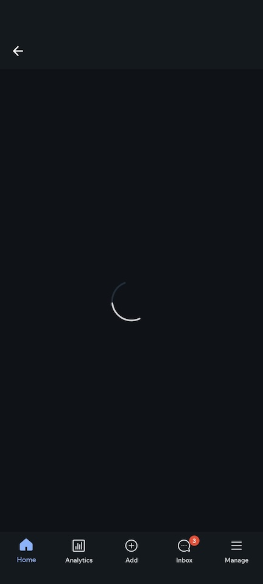

# Dealing With Synchronization Issues in Tests

<!-- markdownlint-configure-file { "header-increment": 0 } -->

Traditionally, one of the most difficult aspects of E2E testing is synchronizing the test scenario with the app. Complex operations inside the app (like accessing servers or performing animations) often take a variable amount of time to complete; In each step, we can’t move on to the next one until they’ve completed (i.e. when the app goes idle), which in turn surfaces a challenge in continously trying to understand when the right time to do so is.

Fortunately, Detox - which comes with a gray-box approach, cleverly performs the synchronization automatically, as explained [here](../articles/how-detox-works.md#how-detox-automatically-synchronizes-with-your-app).

## Mitigating Synthronization Issues

While Detox's auto-synchronization mechanism is powerful and efficient, it does come with at least one caveat: **It imposes strictness over the app's behavior.** By default, Detox will fail your tests (i.e. due to a wait-for-idle **time-out**), if, for example, following an app launch or a navigation to a new screen, timers or animations continue to run endlessly. While this could be considered an advantage (e.g. finding an animation or timer management leakage!), these type of issues may not:

1. Be specifially related to the main coverage goal of your test.
2. Be directly visible to or considered a significant bug by the end user.

Therefore, it may be something some would want to be able to limit or completely opt-out of. With this in mind, let's review the possible ways of mitigation, aimed at either finding and fixing a bug, or allowing for it to be overlooked.

### Step 1: Understanding what's blocking your app

Detox's syncrhonization debugging mechanism generates output to Detox's log which provides useful synchronizationd debugging information. We recommend that you'd start by pinpointing what the busy resources are - those that are keeping you app from going idle, based on those logs. Turn the debugging mechanism toggle on if you need to (although, it is on by default), rerun your test(s) and follow Detox's logs.

:::info

Read about Detox's _synchronization debugging mechanism_ in order to understand how to debug your app for unnecessarily busy resources. It can be specified either via the [Detox configuration file](../config/session.mdx#sessiondebugsynchronization-number) or more directly, as a [CLI argument](../cli/test.md#options):

```js
detox test --debug-synchronization 5000
```

:::

#### (Optional) Lower-level debugging (iOS only)

If the synchronization debugging mechanism does not provide all of the necessary information, on iOS you can add the following launch argument to your app (using `launchArgs` in your `launchApp()` call) to enable a very verbose logging of the idling resource system to the system log:

```plain text
-DTXEnableVerboseSyncSystem YES -DTXEnableVerboseSyncResources YES
```

You can then obtain this log by running the following command:

```bash
xcrun simctl spawn booted log stream --level debug --style compact --predicate "category=='SyncManager'"
```

For example, change your `device.launchApp()` call like:

```js
await device.launchApp({
  newInstance: true,
  launchArgs: { 'DTXEnableVerboseSyncSystem': 'YES', 'DTXEnableVerboseSyncResources': 'YES' },
});
```

### Step 2: Applying the Most Suitable Solution

First and foremost, as explained, an app's inability to go idle might be an indication of that some resources are _unnecessarily_ busy. Thefeore, whether it's a network request that's been left unacknowledged, or an endless loader - 

**The best solution is to fix the problem!:construction_worker:**

#### Dealing with endless animation bugs (e.g. loaders)

Sometimes the resource that's holding the app back from turning idle is a mere animation of a single loader - running endlessly on the screen:



The syncrhonization logs telling you that, would usually look roughly like this:

```
09:04:20.170 detox[90417] i The app is busy with the following tasks:
• UI elements are busy:
  - View animations pending: 2.
  - Layers pending animations: 7.
  - Layers needs layout: 147.
  - View needs layout: 98.
  - View needs display: 67.
  - Layers needs display: 82.
• 1 enqueued native timers:
  - Timer #1:
    + Fire date: none.
    + Time until fire: 0.000.
    + Repeat interval: 0.
    + Is recurring: YES.
```

<sup>(these are logs generated by Detox iOS; Detox-Android generates different yet equivalent ones)</sup>

**Below are a few actual-bug scanerios where this can take place - all of which are easy to inspect, identify and fix.**

##### i. A server is being nonresponsive

Your app is waiting indefinitely to load all of the necessary data from the a nonresponsive server / a bad network, and therefore cannot switch to rendering the expected UI. When this is the deal, additional synchronization logs also repeatedly show some in-flight network calls:

```
09:04:20.170 detox[90417] i The app is busy with the following tasks:
• 1 network requests with URLs:
  - URL #1: https://nonresponsive-server.org/something?id=1337
  - URL #2: https://unreachable-server.org/hello
```

_This can be solved by finding out why the server is being nonresponsive or unreachable, for example - by tracking network calls into the logs, or inspecting requests on the server-ends._

##### ii. A returned server error is not conveyed by the UI

Sometimes the servers _do_ respond, **but with an error**. Often times, we fail to adjust our app code so as to display the necessary UI (e.g. replacing the loader with a friendly message). Rather, the loader just remains running indefinitely. Unlike in the previous case, you will not see synchronization-debug logs surfacing those unacknowledged network calls. 

_Scan through the **app/device** logs (not Detox log!) from the bottom up and find traces of errors. The app/device logs can be automatically recorded by Detox as a test-run artifact._

##### iii. An app error is ignored

Last but not least, this behavior can be the result of an app bug around handling **valid data returned from the server**, such as an error while parsing the data.

_Look up the error - which usually comes with a stack-trace and is therefore very prominent, in the test summary in the (also Detox) logs. If it's not in the summary itself, you'd have to resort to searching those in the app/device logs. The app/device logs can be automatically recorded by Detox as a test-run artifact._

#### Dealing with looping animations

Animations are ultimately a way of making our apps friendlier and nicer to use. Sometimes a good user experience comes specifically from animations that are forever-looping on purpose (for example. animated `.gif`s).

Detox currently has no API's for "black listing" animations - namely, excluding them from the synchronization process (i.e. as it does with network calls). Therefore, you might want to consider removing the looping animation in your tests by rebuilding the app with such animating elements replaced by [mocks](../guide/mocking.md).

#### Dealing with **hidden** animations

**Not all synchronization issues around animations are trivial:**

* The animation can be associated with an element that is rendered off-screen, such as an item in a long news feed that's been rendered beyond the screen's bound, or a loader in a screen associated with a bottom tab that hasn't been naviagated-to since the beginning of the test.
* The animation can also be associated with elements which have been silently leaked (bug) under other UI elements. They are fully functional yet not visibile to the user. For example: A compact loader accidently showing under the app bar (android)/navigation bar (iOS).

These types of animations can be difficult to track down, and sometimes fix.

**We are aiming to provide more advanced Detox-complementary tools that would help identify such animations more easily (follow github issue [#4734](https://github.com/wix/Detox/issues/4734)). Until we do, here are some things you can do, roughly, in order:**

1. _(Most recommended) Start Detox in [debug mode](../introduction/debugging.mdx), and then run the blocked test step-by-step - either from the beginning of it, or starting a breakpoint you've set over where you think the synchronization issue starts. Step over the Detox commands until Detox gets blocked and signals for syncrhonization issues (i.e. in the logs). Then, explore the app yourself (!), physically looking for animations (e.g. by scrolling lists, navigating through tabs, and so on.
   You might actually be able to see the animation in your own eyes, or witness Detox getting unblocked as your interactions release an otherwise endless loader._
   _Do this iteratively until the exact animating UI element can be pinpointed._

2. _Run the test and [generate a view-hierarchy](../api/device.md#devicecaptureviewhierarchyname) at the right timing, then inspect your app's layout in xcode's powerful view-hierarchy inspector_. Look for off-screen or obscured elements.

3. _Run your app (without Detox) on Android in debug mode using Android Studio, and use its fancy [Layout Inspector](https://developer.android.com/studio/debug/layout-inspector) tool in order to inspect your app._

4. _Perform a "binary search" over the screen's content: Remove big blocks of content from it intermittently, rerunning the failing test each time, until synchronization stops blocking you. Then, slowly bring back repeatedly smaller and smaller sub-elements of the UI to see which one retriggers synchronization blockage. Eventually, you could pinpoint the exact culprit._

#### Dealing with network synchronization issues

Sometimes Detox synchronization gets block, waiting for networks call that are in fact associated with URL's that happen to be "noise", meaning - specifically related to some kind of long polling background tasks, or web-socket connections. Such network calls should NOT be considered blocking in a user-flow test.

_This can be solved by [black-listing the URL's in Detox](../api/device.md#deviceseturlblacklisturls), which would exclude it from Detox's synchronization over the network:_

```js
// Black-list (exclude) URL's in mid test-run:
await device.setURLBlacklist(['.*127.0.0.1.*']);

// Black-list URL's from as early as app launch:
await device.launchApp({
  launchArgs: {
    detoxURLBlacklistRegex: '(".*example.com/some-url/.*")',
  },
});

// Reset black-list
await device.setURLBlacklist([]);
```

#### Dealing with endless timers

By default, Detox is designed to ignore JavaScript's `setInterval()` and will only wait for `setTimeout()`'s **of up to 1.5 seconds**.

*If you have an endless polling loop with short intervals implemented with `setTimeout`, switch the implementation to `setInterval`. If possible, avoid aggressive polling in your app altogether, the poor single JavaScript thread we have doesn’t like it.*

#### Last resort: Switching to manual synchronization as a workaround

If you can't find the source of the problem, or otherwise decide not to fix it (temporarily...), Detox always has the fail-safe solution of turning off automatic-synchronization altogether and waiting manually for elements.

This isn’t the recommended approach as you'd be giving up Detox's syncrhonization super-powers and resort to manually defining timeouts, but hey, life is about tradeoffs. You can do this with the main [syncrhonization switching API's](../api/device.md#devicedisablesynchronization):

```js
// Disabling in mid test-run:
await device.disableSynchronization();

// Launching the app with sync disabled from the start:
await device.launchApp({
  launchArgs: {
    detoxEnableSynchronization: 0
  },
});

// To turn synchronization back on (this command will block on synchronization):
await device.enableSynchronization();
```

Mind that when this technique is applied, it effectively means that have to start using Detox API's differently (i.e. resort to using [`withTimeout()` API's](../api/expect.md#withtimeouttimeout)) and possibly even migrate test code.

For example, instead of:

```js
await element(by.id('write-message-btn')).tap(); // Navigate to message writing screen
await element(by.id('message-input')).typeText('Hello!'); // Type in a message
await element(by.id('submit-btn')).tap(); // Submit!
```

Your test code will have to look more like this:

```js
await device.disableSynchronization();

await element(by.id('write-message-btn')).tap();

// Wait up to 4 seconds for the screen to fully load
await waitFor(element(by.id('message-input'))).toBeVisible().withTimeout(4000);

await element(by.id('message-input')).typeText('Hello!');
await element(by.id('submit-btn')).tap();
```

##### Hybrid manual/automatic synchronization

As of writing this, fine-tuned control over the various synchronized OS-systems that Detox monitors is not supported. Follow issue [#1513](https://github.com/wix/Detox/issues/1513) to keep track of that.


