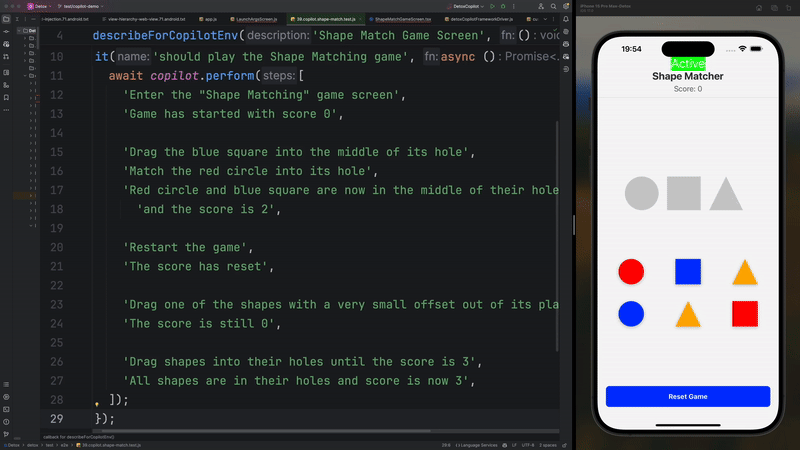

# Natural Language Testing with Detox Copilot

In this tutorial, we'll explore how to use **Detox Copilot** to write end-to-end tests using natural language commands. Detox Copilot leverages large language models (LLMs) to translate human-readable instructions into Detox actions and assertions, making test writing more intuitive and accessible.

:::note

Copilot now has a new [documentation site](https://wix-incubator.github.io/detox-copilot/).<br/>
There, you can find a [technical overview](https://wix-incubator.github.io/detox-copilot/docs/guides/technical-overview), learn how to [implement a driver for your preferred testing framework](https://wix-incubator.github.io/detox-copilot/docs/guides/implementing-custom-testing-framework-driver), and stay up to date with the latest features and updates.

:::

:::caution Work in Progress

**Note**: Detox Copilot is in active development. APIs are subject to change in future releases.<br/>
For complete API details, refer to our [Detox Copilot API documentation](../api/copilot.md).

:::

## Introduction

Detox Copilot simplifies the process of writing tests by allowing you to describe test steps in natural language.
It interprets these instructions and translates them into Detox commands. This guide will help you integrate Detox Copilot into your testing workflow and provide best practices for writing effective intents.



## Implementing a `PromptHandler`

The `PromptHandler` is a crucial component that interfaces with your LLM service.
Below is an example of how to implement a `PromptHandler` using OpenAI's GPT-4 API.

You can adapt this code to work with other LLMs or services as needed. You may also find pre-built `PromptHandler` implementations for popular LLMs in the [detox-copilot repository on GitHub](https://github.com/wix-incubator/detox-copilot).

:::note Open for Contributions

If you have implemented a `PromptHandler` for a specific LLM or service, consider contributing it to the Detox Copilot repository to help the community.

:::

### Example of a `PromptHandler` for OpenAI's GPT-4

```javascript
import OpenAI from 'openai';

const path = require('path');

class OpenAIPromptHandler {
  constructor(apiKey) {
    const configuration = new OpenAI({ apiKey });
    this.openai = new OpenAI(configuration);
  }

  async runPrompt(prompt, imagePath) {
    const messages = [
      { role: 'system', content: 'You are a test automation assistant.' },
      { role: 'user', content: prompt },
    ];

    // If an image is provided, "upload" it and include the URL in the prompt
    if (imagePath && this.isSnapshotImageSupported()) {
      try {
        const imageUrl = await this.uploadImage(imagePath);
        messages.push({
          role: 'user',
          content: `Here is an image for reference: ${imageUrl}`,
        });
      } catch (error) {
        console.error('Error uploading image:', error);
        throw new Error('Failed to upload image');
      }
    }

    const response = await this.openai.chat.completions.create({
      model: 'gpt-4',
      messages,
    });

    return response.data.choices[0].message.content;
  }

  async uploadImage(imagePath) {
    // Uploads the image and returns the URL
  }

  isSnapshotImageSupported() {
    return true; // Set to true to handle image uploads
  }
}

module.exports = OpenAIPromptHandler;
```

**Explanation**:

- **`runPrompt`**: Sends the prompt to the LLM and returns the response.
- **`isSnapshotImageSupported`**: Indicates whether the LLM can handle snapshot images. If set to `true`, the handler will include image URLs in the prompt and will include them when instructing Detox Copilot.

## Initializing Detox Copilot

Initialize Detox Copilot with your `PromptHandler` before running any tests.
This is typically done in the `beforeAll` hook or a setup file.

**Example**:

```javascript
const {copilot} = require('detox/index');
const OpenAIPromptHandler = require('./OpenAIPromptHandler');

beforeAll(() => {
  const promptHandler = new OpenAIPromptHandler('YOUR_OPENAI_API_KEY');
  copilot.init(promptHandler);
});
```

## Writing Tests with Detox Copilot

With Detox Copilot initialized, you can now write tests using the `copilot.perform` method.

### Writing Step-by-Step Tests

Detox Copilot allows you to write tests by providing a sequence of natural language instructions. Each instruction corresponds to a single action or assertion.

```javascript
it('should verify element sizes and button states', async () => {
  await copilot.perform(
    'Launch the app with notification permissions enabled',
    'Navigate to the "Settings" page',
    'Verify that the "Save" button is disabled',
    'Locate the profile picture element',
    'Verify that the profile picture size is 100 x 100 pixels and that the image is available and rendered',
    'Tap on the "Edit Profile" button',
    'Verify that the "Save" button is now enabled',
    'Verify that the "Username" field text is bold'
  );
});
```

In the example above, Copilot can perform checks that go beyond traditional UI testing, such as verifying element sizes, button states (enabled/disabled), or text styles (e.g., bold). This is thanks to the combination of Detox code-generation and multimodal LLMs that can analyze the snapshots.

- **Step-by-Step Instructions**: Each step is a separate string, representing a single action or assertion.
- **Sequential Execution**: Steps are executed in order, allowing you to describe complex interactions intuitively.

### Hybrid Tests with Copilot and Detox APIs

You can also combine Copilot commands with traditional Detox APIs for more control.

```javascript
it('should add an item to the cart', async () => {
  await copilot.perform(
    'Launch the app',
    'Navigate to the "Products" page',
    'Tap on the "Add to Cart" button for the first product'
  );

  const cartBadge = element(by.id('cart-badge'));
  await expect(cartBadge).toHaveText('1');

  await copilot.perform(
    'Navigate to the "Cart" page',
    'Verify that the product is listed in the cart'
  );
});
```

### Locating Elements with Copilot

You can also use Copilot to retrieve values, locate elements, or perform advanced checks such as verifying element sizes or button states.

```javascript
it('should display the correct page title', async () => {
  const pageTitleElement = await copilot.perform(
    'Launch the app',
    'Navigate to the "Profile" page',
    'Locate the page title element'
  );

  await expect(pageTitleElement).toHaveText('Profile');
});
```

## Contributing to Detox Copilot

Contributions are welcome!
Visit the [Detox Copilot GitHub Repository](https://github.com/wix-incubator/detox-copilot) to open issues or pull requests if they are relevant to the core-library functionality or open a it under [Detox repository](https://github.com/wix/Detox) if it is related to Detox-Copilot integration or if you are not sure where the issue should be opened.
