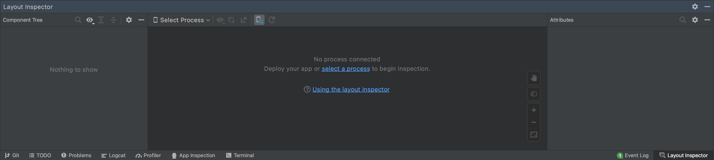
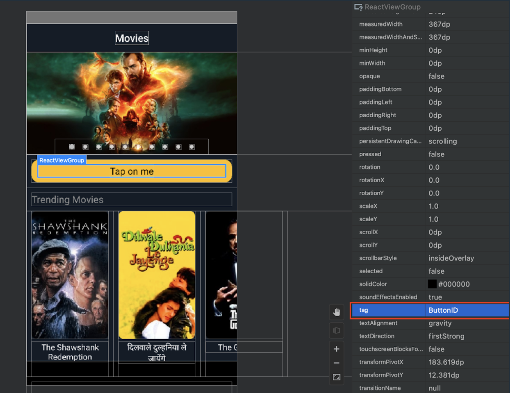

1. Make sure that React Native packager is already running. If not, you can start it with:
    ```bash
    npx react-native start
    ```
1. Launch Android Studio.
1. Open `Tools > Layout Inspector` tool:
    
1. Build your application from Android Studio.
1. After you run your app from Android Studio, the `Layout Inspector` should automatically attach to the process and show the hierarchy of your screen. You will see the snapshot of your screen, where you can focus on any component with a click.
    :::tip
    If `Layout Inspector` doesn't attach to process from Android Studio, or you build it in a different way – you can attach to your app process manually using `Select Process` dropdown.
    :::
1. Select the component you need, and you will see your actual testID value under the `tag` attribute.
    
