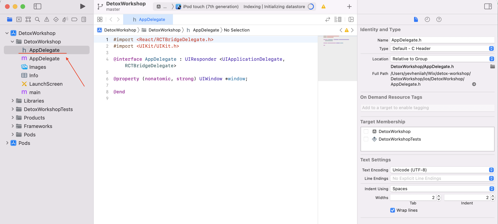
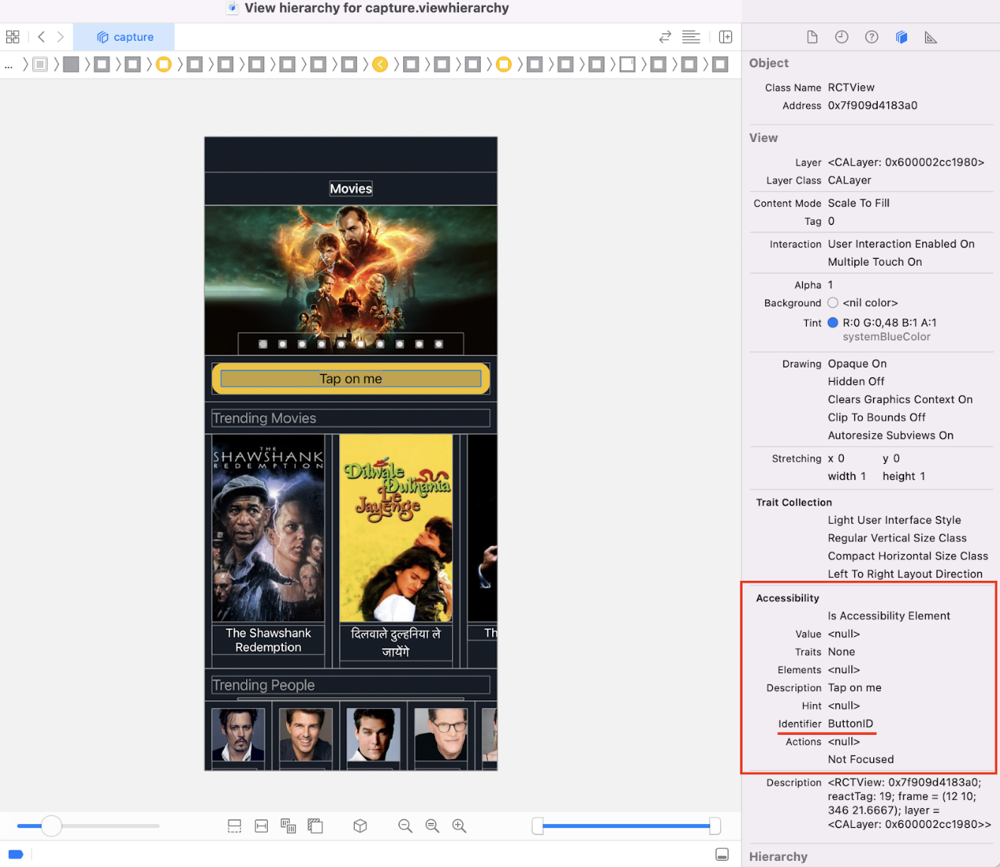

1. Build and start your app in _debug_ mode as you usually do, e.g.:
    ```sh
    detox build -c ios.sim.debug
    npx react-native start
    npx react-native run-ios
    ```
1. Open your iOS project in Xcode, e.g. `YourProject/ios/YourProject.xcworkspace`.
1. Go to `Debug > Attach to Process` and select your app process (it is usually on top of the list).
    
    You will see a new device started with your app.
1. Open the `AppDelegate` file:
    
1. Click `Debug View Hierarchy` button on the bottom panel:
    
1. Select the component you need, and you will see your actual `testID` value under the `Accessibility > Identifier` attribute.
    
