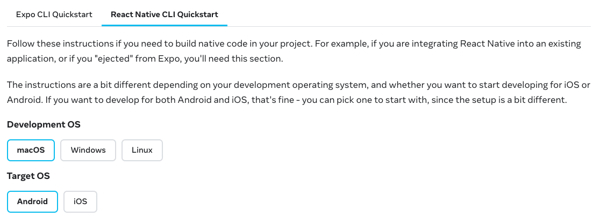

# Environment Setup

import Tabs from '@theme/Tabs';
import TabItem from '@theme/TabItem';

import IntroRN from './partials/_getting-started-rn.md';
import IntroExpo from './partials/_getting-started-expo.md';
import IntroOther from './partials/_getting-started-other.mdx';

The _Introduction section_ walks you through setting up Detox in your project, one step at a time.

You will find that some steps are longer than the others: some are a couple of paragraphs, while the others look like a dedicated multistep guide.
Bear with us - it is all necessary, and once set up, it is easy to move forward with writing tests at a high pace.

Please select type of your mobile application before you start the tutorial:

<Tabs groupId="appType">
    <TabItem value="start-rn" label="React Native" default>
        <IntroRN />
    </TabItem>
    <TabItem value="start-expo" label="Expo">
        <IntroExpo />
    </TabItem>
    <TabItem value="start-other" label="Other">
        <IntroOther />
    </TabItem>
</Tabs>

## React Native CLI Quickstart

Your first step would be to complete the
[📚 React Native CLI Quickstart Guide](https://reactnative.dev/docs/next/environment-setup) for iOS/Android/both (depending
on your use case).

:::info Note

Mind that for Android, we have an equivalent [environment setup guide](../guide/android-dev-env.md), which is a bit different,
but more comprehensive. Use your judgement and take what's most suitable for your environment from both guides. For
example, there is more than one way to install the right Java Development Kit.

:::



<p>
    Open the link above and switch there to <b>React Native CLI Quickstart</b> tab to see
    the interactive tutorial for <b>Development OS</b> and <b>Target OS</b> of your choice.
</p>

<p>
    Follow all
    the steps <span style={{color: 'red'}}>(yes, even if you have a native app!)</span> and
    make sure you can create and run React Native apps on virtual testing devices.
</p>


## Detox Prerequisites

To complete the environment setup, you still have 2 steps ahead: installing `detox-cli` and `applesimutils`.

### 1. Command Line Tools (`detox-cli`)

`detox-cli` is merely a script that passes commands through to
a local Detox executable located at `node_modules/.bin/detox`,
making it easier to operate Detox from the command line, e.g. `detox test -c ios.sim.debug`.

It should be installed globally, enabling usage of the command line tools outside your npm scripts:

```bash npm2yarn
npm install detox-cli --global
```

On the other hand, if you are fine with running Detox commands with `npx detox ...`, you may skip installing `detox-cli`.

### 2. [MacOS Only] `applesimutils`

This tool is **required** by Detox to work with iOS simulators. The recommended way to install
[`applesimutils`](https://github.com/wix/AppleSimulatorUtils) is via [Homebrew](https://brew.sh):

```bash
brew tap wix/brew
brew install applesimutils
```

:::info Note

Make sure to periodically update your version of `applesimutils` to the latest version.

:::

Now, when your environment is ready, let's move to the next section, [Project Setup](project-setup.mdx).
