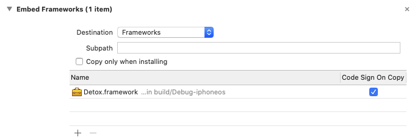

1. Go to `node_modules/detox` and extract `Detox-ios-src.tbz`

    

1. Drag `Detox-ios-src/Detox.xcodeproj` into your Xcode project

    

1. Go to your project settings → **General** and add **Detox.framework** to **Frameworks, Libraries, and Embedded Content** (make sure **Embed & Sign** is selected under **Embed**)

    

:::caution

Apps should not be submitted to the App Store with the Detox framework linked. Follow this guide only to debug Detox issues in your project. Once finished, make sure to remove **Detox.framework** from your project.

:::

