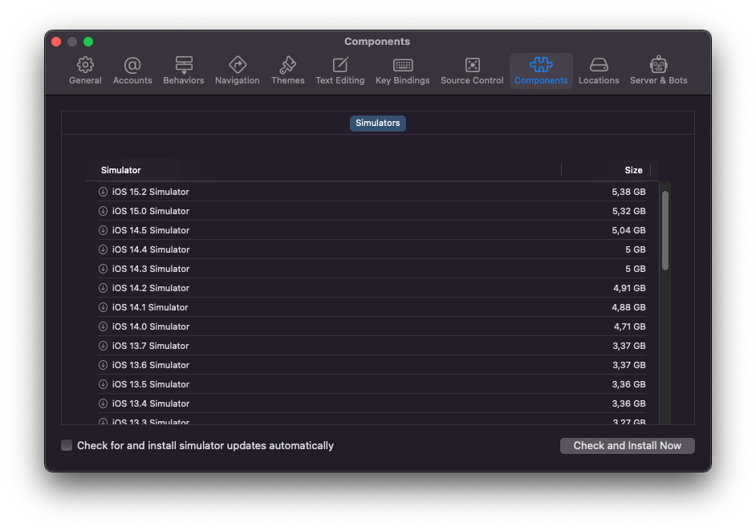

To check if a specific device type (e.g. `iPhone 15`) is installed locally, run:

```bash
xcrun simctl list devicetypes
```

If it is available, you'll see it among the other device types in the output:

```plain text
== Device Types ==
iPhone 4s (com.apple.CoreSimulator.SimDeviceType.iPhone-4s)
iPhone 5 (com.apple.CoreSimulator.SimDeviceType.iPhone-5)
…
iPhone SE (2nd generation) (com.apple.CoreSimulator.SimDeviceType.iPhone-SE--2nd-generation-)
iPhone 12 mini (com.apple.CoreSimulator.SimDeviceType.iPhone-12-mini)
// highlight-next-line
iPhone 15 (com.apple.CoreSimulator.SimDeviceType.iPhone-15)
iPhone 15 Pro (com.apple.CoreSimulator.SimDeviceType.iPhone-15-Pro)
…
```

If there is no such device type, you can replace it with another from the list:

```diff
   simulator: {
     type: 'ios.simulator',
     device: {
-      type: 'iPhone 12',
+      type: 'iPhone 13 Pro',
     },
   },
```

:::tip

If the device type list is empty or you need a specific iOS version,
go to `Xcode > Preferences > Components` and install a proper Simulator version from the list:



:::
